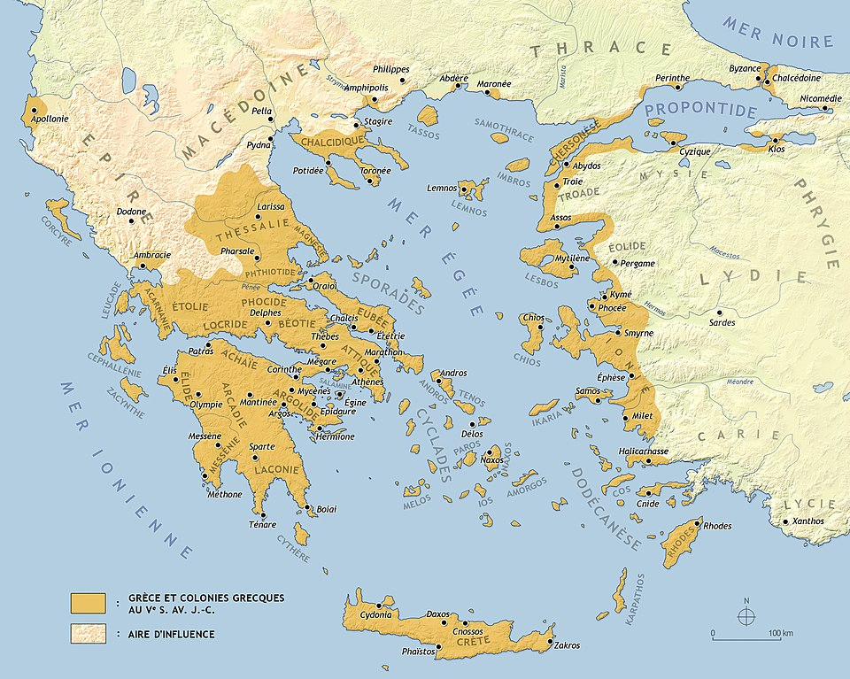

# L'Architecte et l'Héritier : Comment Philippe II a Forgé un Empire pour Alexandre le Grand

## Introduction : Le Paradoxe Macédonien

L'ascension fulgurante de la Macédoine au IVe siècle avant J.-C. présente l'un des paradoxes les plus fascinants de l'histoire antique. Comment ce royaume — longtemps considéré par ses voisins du sud comme un territoire pauvre, faible, politiquement fragmenté et semi-barbare — a-t-il réussi à conquérir et unifier l'ensemble du monde hellénique en une seule génération ? La diffusion ultérieure de la culture grecque, ou hellénisme, à travers le monde connu est souvent comprise à travers un modèle simpliste de diffusion culturelle, suggérant que sa supériorité inhérente a conduit à son adoption volontaire par d'autres. La réalité historique, cependant, est bien plus complexe et violente. L'expansion de l'hellénisme n'était pas un processus passif mais une conséquence directe de la conquête militaire, un projet conçu et initié non par un Grec quintessentiel comme un Athénien ou un Spartiate, mais par un roi macédonien considéré comme un étranger : Philippe II.

Pour démêler ce paradoxe, ce rapport emploiera deux cadres analytiques puissants. Le premier est l'archétype du "Père et du Fils", une lentille à travers laquelle voir les rôles distincts mais inextricablement liés du fondateur méthodique et de l'héritier ambitieux. Cette dynamique encapsule parfaitement la relation entre Philippe II, l'architecte qui a patiemment construit l'État macédonien et son armée révolutionnaire à partir de rien, et son fils, Alexandre le Grand, qui a hérité de cette formidable machine de conquête et l'a menée jusqu'aux confins de la terre. Le second cadre est la théorie géopolitique du "Pauvre Conquiert le Riche", qui postule que les sociétés forgées dans l'adversité, possédant une plus grande unité, discipline et faim, peuvent vaincre des rivaux plus riches, plus sophistiqués culturellement, mais décadents et divisés. Ce modèle fournit une explication convaincante de la façon dont les Macédoniens robustes et unis ont pu démanteler systématiquement les cités-États grecques discordantes et fatiguées par la guerre.

Ce rapport soutiendra que Philippe II était la véritable figure révolutionnaire de l'époque. Ses réformes militaires, politiques et économiques radicales étaient la fondation indispensable sur laquelle tous les exploits légendaires d'Alexandre ont été construits. Bien qu'Alexandre ait possédé un génie unique et audacieux, c'était un génie d'application et d'expansion, non de création. Il était l'héritier du plus grand instrument militaire et politique de son époque, et pour comprendre les conquêtes spectaculaires du fils, on doit d'abord apprécier les réalisations profondes et transformatrices du père qui l'a forgé.

## Partie I : Cadres Conceptuels pour la Conquête

Pour comprendre la mécanique de l'ascension de la Macédoine, il est essentiel d'établir d'abord les lentilles théoriques à travers lesquelles les événements historiques seront analysés. Le récit historique de Philippe et Alexandre n'est pas simplement une séquence de batailles et de traités ; c'est une illustration puissante d'archétypes récurrents dans l'histoire et la géopolitique. En développant les concepts du "Fondateur et de l'Héritier" et de "l'Ascendance de la Périphérie", nous pouvons dépasser une simple chronique d'événements pour une compréhension plus profonde des dynamiques humaines et sociétales qui ont permis la conquête d'un monde.

### 1.1 Le Fondateur et l'Héritier : Un Conte de Père et Fils

La relation entre un fondateur visionnaire et un successeur brillant est un thème récurrent dans les annales de l'histoire, des affaires et de l'empire. La dynamique entre Philippe II et Alexandre le Grand sert d'exemple quintessentiel de cet archétype, où les qualités distinctes du "Père" et du "Fils" ne sont pas seulement différentes mais sont liées de manière causale et symbiotique. L'un crée les conditions qui rendent possible le succès de l'autre.

#### L'Archétype du "Père" (Philippe II)

La figure du "Père" est l'architecte, l'individu qui construit une organisation formidable à partir d'une fondation de pénurie et de chaos. Son succès est enraciné dans un ensemble spécifique de traits de caractère orientés vers la création et la consolidation.

**Innovant et Visionnaire :** La caractéristique principale du fondateur est la capacité de voir le potentiel là où d'autres ne voient rien. Il est soit un innovateur avec une idée révolutionnaire nouvelle, soit possède la sagesse et le jugement pour reconnaître et adapter les meilleures idées des autres. La vision de Philippe n'était pas limitée à la survie à court terme ; il possédait un plan stratégique à long terme pour transformer la Macédoine d'un État frontalier vulnérable en hégémon de la Grèce, prélude nécessaire à une vision encore plus grandiose : la conquête de la Perse. Cette qualité visionnaire est un fil conducteur parmi d'autres dirigeants transformateurs de l'histoire, comme Gengis Khan ou Mahomet, qui ont imaginé un nouvel ordre mondial et ont ensuite travaillé systématiquement pour l'atteindre.

**Gestionnaire Efficace et Méritocratique :** Partant de rien, le fondateur ne peut pas s'appuyer sur des structures existantes de loyauté ; il doit les construire. Ceci est accompli grâce à une gestion efficace des personnes, les inspirant avec une vision convaincante de croissance future et de succès partagé. Crucialement, le fondateur est juste et méritocratique, promouvant les individus basés sur le talent et la contribution, non le favoritisme ou la flatterie. La relation de Philippe avec son général Parménion, un homme de noblesse inférieure à qui il faisait confiance pour un commandement indépendant, exemplifie ce principe. En promouvant le talent, le fondateur renforce l'organisation de l'intérieur, assurant sa viabilité à long terme.

**Discipliné et Désintéressé :** L'attention du fondateur est implacablement sur le "bien commun" — le succès et la stabilité de l'organisation qu'il construit. Cela nécessite une discipline personnelle immense et un dévouement désintéressé qui place l'objectif collectif au-dessus du bonheur ou de la gloire personnels. Il dirige par l'exemple, travaillant plus dur et sacrifiant plus que quiconque, gagnant ainsi la loyauté authentique de ses partisans. Le leadership personnel de Philippe au combat, où il a subi de nombreuses blessures, y compris la perte d'un œil, a démontré à ses soldats qu'il partageait leurs risques et était fanatiquement dévoué à la cause d'une Macédoine plus grande.

#### L'Archétype du "Fils" (Alexandre le Grand)

L'archétype du "Fils" représente l'héritier qui prend le contrôle d'une organisation puissante et entièrement formée. Son chemin vers le succès, et en effet toute sa constitution psychologique, est fondamentalement différent de celui du fondateur.

**Preneur de Risques Agressif :** L'héritier n'a pas besoin de construire ; il a besoin d'étendre. Son succès est défini par sa volonté de prendre des risques audacieux que le fondateur, qui avait tout à perdre, n'aurait jamais pu prendre. Avec une armée puissante et un trésor plein à sa disposition, Alexandre pouvait parier sur des stratégies audacieuses et des campagnes rapides de conquête, exploitant les actifs que son père avait patiemment accumulés pour atteindre des résultats d'une magnitude entièrement différente.

**Motivé par la Gloire Personnelle et l'Insécurité :** Tandis que le père est motivé par la vision de construire une grande entreprise, le fils est souvent motivé par un besoin psychologique puissant de gloire personnelle. Il vit dans l'ombre de la réalisation monumentale du fondateur, entendant constamment que sa position est un produit d'héritage, non de mérite. Cela engendre une insécurité profondément enracinée et une ambition implacable de non seulement émuler, mais de dépasser son père. La poussée insatiable d'Alexandre à avancer toujours vers l'est, au-delà des limites de la vision de son père, peut être comprise comme une manifestation de ce besoin de sculpter un héritage qui était sans équivoque le sien.

**Promoteur de Loyauté plutôt que de Talent :** L'héritier valorise souvent la loyauté personnelle et l'obéissance au-dessus de la pure méritocratie du fondateur. Il s'entoure d'amis et de compagnons (les hetairoi dans le cas d'Alexandre), récompensant ceux qui lui sont personnellement dévoués. Ce changement d'une base institutionnelle à une base personnelle pour la loyauté peut être une source de force à court terme, favorisant une structure de commandement soudée, mais il peut aussi introduire le factionnalisme et le favoritisme que le fondateur avait travaillé si dur à éviter.

Les carrières de Philippe et Alexandre démontrent une symbiose historique profonde. La construction patiente et méthodique de l'État de Philippe — le travail du "Père" — a créé les ressources mêmes d'une armée professionnelle, d'un trésor sécurisé et d'un État unifié qui étaient les prérequis pour la stratégie d'expansion rapide et à haut risque d'Alexandre. Les conquêtes d'Alexandre n'étaient pas simplement une extension du plan de Philippe mais un type différent d'entreprise, rendu possible seulement par la stabilité que son père avait construite. Sans la fondation de Philippe, l'ambition d'Alexandre aurait été sans base. Inversement, sans l'ambition inégalée d'Alexandre, la création de Philippe aurait pu rester une puissance régionale plutôt que le tremplin d'un empire qui a transformé le monde. Leurs règnes représentent deux phases nécessaires et séquentielles de construction d'empire.

### 1.2 L'Ascendance de la Périphérie : Comment le "Pauvre" Conquiert le "Riche"

L'histoire regorge d'exemples de puissances périphériques apparemment arriérées surmontant et conquérant des civilisations établies et riches. Ce phénomène, qui semble contre-intuitif, peut être expliqué par un modèle qui contraste les caractéristiques sociétales des nations "pauvres" et "riches", où la richesse n'est pas seulement économique mais aussi culturelle et politique.

#### La Théorie Expliquée

L'analogie moderne de la Corée du Nord et du Sud illustre les principes fondamentaux de cette théorie. Une société "riche" comme la Corée du Sud, avec sa technologie avancée et sa richesse, peut devenir victime de son propre succès. Elle peut développer de profondes inégalités sociales et économiques, conduisant à une perte de cohésion sociale et à un déclin démographique né du pessimisme sur l'avenir. Ses citoyens peuvent perdre la "faim" et la résilience qui caractérisaient leurs ancêtres. En contraste, une société "pauvre" comme la Corée du Nord, malgré ses déficits économiques et technologiques, peut posséder certains avantages stratégiques : sa pauvreté peut favoriser un sentiment d'égalité et d'unité, son système politique peut imposer l'obéissance, et son peuple, endurci par l'adversité, est "affamé" et disposé à travailler et sacrifier pour des objectifs collectifs. Cette combinaison d'unité, d'obéissance et de faim peut être forgée en une arme militaire et politique puissante, permettant à la nation plus pauvre d'exercer sa volonté sur, et même d'extraire des ressources de, son voisin plus riche mais plus fragile.

Ce n'est pas simplement un modèle économique ; c'est fondamentalement une théorie de cohésion sociale et de volonté politique. La "pauvreté" de la puissance ascendante est une source de force parce qu'elle nécessite un niveau d'unité et de but collectif que la puissance "riche", avec ses divisions internes complexes et ses intérêts concurrents, ne peut plus rassembler.

#### La Macédoine comme Puissance "Pauvre"

Au IVe siècle avant J.-C., la Macédoine incarnait parfaitement les caractéristiques de la puissance "pauvre" mais ascendante.

**Affamée :** Les Macédoniens étaient un peuple de paysans robustes et de montagnards rudes, habitués à une vie d'adversité et de guerre contre leurs voisins "barbares". Ils étaient motivés par les promesses tangibles de stabilité, de terre et de butin de guerre que le nouveau système de Philippe offrait.

**Unie :** Le génie politique de Philippe était de reconnaître que l'état fragmenté de la Macédoine pouvait être surmonté en créant une nouvelle institution unificatrice : l'armée professionnelle. Il forgea un nouveau contrat social où le service au roi était le chemin principal vers la richesse, l'honneur et le statut. Les chefs tribaux rivaux devinrent sa loyale Cavalerie Compagnon, et les paysans devinrent de fiers fantassins dans la phalange, leurs identités et fortunes maintenant liées directement au roi et à l'État, non à leurs clans locaux. Cela créa un sentiment puissant d'identité nationale et de but.

**Obéissante :** La création d'un militaire à temps plein, professionnel et constamment entraîné engendra un niveau de discipline et de cohésion qui était inimaginable dans les milices citoyennes des cités-États grecques. Ce n'étaient pas des fermiers qui se battaient à temps partiel par devoir civique ; c'étaient des soldats de carrière dont les vies étaient dédiées à l'armée et dont la loyauté était envers leur commandant, Philippe.

#### La Grèce comme Puissance "Riche"

Le monde grec, particulièrement Athènes, représentait la puissance "riche" et établie. Il était culturellement et économiquement avancé mais souffrait de faiblesses structurelles fatales.

**Riche mais Décadente :** Athènes possédait une grande marine et une richesse immense de son empire commercial, mais ses citoyens n'étaient plus les soldats endurcis des Guerres Persiques. Ils s'appuyaient de plus en plus sur des mercenaires pour combattre leurs batailles, signe d'une société perdant sa vigueur martiale.

**Politiquement Fragmentée :** La plus grande faiblesse du monde grec était sa désunion politique. La polis, ou cité-État, était l'unité fondamentale de la vie politique, et une "xénophobie obstinée" et une rivalité ancrée empêchaient toute coopération durable. La Guerre du Péloponnèse dévastatrice entre Athènes et Sparte, suivie par l'hégémonie thébaine, avait laissé les cités-États épuisées, mutuellement méfiantes et incapables de former un front uni contre la menace macédonienne montante jusqu'à ce qu'il soit bien trop tard. Leur "richesse" était un handicap parce qu'elle était liée à un système politique qui empêchait activement l'unité nécessaire à la survie contre un autocrate déterminé et unifié comme Philippe.

## Partie II : Philippe II, l'Architecte d'un Empire

Le règne de Philippe II (359-336 avant J.-C.) représente l'une des transformations les plus remarquables de l'histoire antique. En un peu plus de deux décennies, il prit un royaume au bord de l'effondrement et en forgea la puissance dominante en Europe. Ce n'était pas une question de chance ou de circonstance, mais le résultat d'un programme systématique et révolutionnaire de réforme militaire, politique et économique. Il était l'architecte qui conçut et construisit les fondations d'un empire.

### 2.1 Le Monde que Philippe Hérita (359 av. J.-C.) : Une Grèce Fracturée et une Macédoine Vulnérable

Quand Philippe monta sur le trône, il n'hérita pas d'un royaume mais d'une crise. La Macédoine était dans un état de péril existentiel, tandis que le monde grec au sud était un chaudron de puissances rivales épuisées, créant un vide de pouvoir qu'un dirigeant de la vision et de l'impitoyabilité de Philippe pouvait exploiter.

#### L'État Géographique et Politique de la Macédoine

La Macédoine était une terre de contrastes saisissants, un royaume à la périphérie du monde hellénique, considéré semi-barbare par les Athéniens culturellement sophistiqués.

**Géographie :** Le royaume était géographiquement divisé. Les plaines côtières du sud étaient fertiles et agricoles, tandis que l'intérieur nord et ouest était dominé par des hautes terres montagneuses rugueuses. Ce terrain rendait l'unification politique difficile, favorisant des tribus indépendantes et rebelles dans les hautes terres qui pillaient fréquemment les terres agricoles des plaines. Cependant, cet environnement difficile produisait aussi une population robuste et résiliente et fournissait des ressources naturelles cruciales, particulièrement le bois de haute qualité nécessaire à la construction navale et à la production de la sarisse, ainsi que de précieux gisements minéraux.

**Faiblesse Politique :** Intérieurement, la monarchie macédonienne était historiquement faible, tourmentée par des nobles en conflit et une histoire sanglante de crises de succession et d'assassinats royaux. Extérieurement, la Macédoine était entourée d'un anneau de puissances hostiles. À l'ouest et au nord se trouvaient les belliqueux Illyriens, Péoniens et Thraces, qui lançaient des raids dévastateurs en territoire macédonien. L'année où Philippe prit le pouvoir, son frère le roi Perdiccas III et 4 000 soldats macédoniens avaient été tués dans une bataille désastreuse contre les Illyriens. Au sud se trouvaient les puissantes et souvent méprisantes cités-États grecques — Thèbes, Athènes et Sparte — qui cherchaient à contrôler les villes côtières macédoniennes et à se mêler de sa politique interne. À divers moments de son histoire, la Macédoine avait même été forcée d'exister comme un État vassal, payant tribut à ses voisins et même au lointain Empire perse.

#### L'État de la Grèce

La péninsule grecque en 359 avant J.-C. était un paysage d'épuisement politique. Les grandes puissances qui avaient dominé le Ve siècle étaient des ombres de leur ancien moi. La Guerre du Péloponnèse (431-404 av. J.-C.) avait brisé l'Empire athénien et saigné à blanc Athènes et Sparte. L'hégémonie spartiate, établie après la guerre, s'avéra de courte durée et brutale, et fut définitivement brisée par les Thébains sous le brillant général Épaminondas à la Bataille de Leuctres en 371 av. J.-C. Cependant, la propre domination de Thèbes était éphémère et largement dépendante de la vie d'Épaminondas lui-même. Au moment où Philippe arriva au pouvoir, Athènes restait riche et culturellement prééminente mais était militairement affaiblie et politiquement volatile. Les cités-États étaient prises dans un cycle d'alliances changeantes et de guerre endémique, pathologiquement incapables de coopérer contre une menace externe. Ce vide de pouvoir était l'opportunité stratégique que Philippe était uniquement préparé à saisir.

### 2.2 Forger la Machine de Guerre : La Révolution Militaire Macédonienne

La réalisation la plus tangible et révolutionnaire de Philippe fut la création de l'armée macédonienne. Il transforma une levée désorganisée et démoralisée de paysans et de nobles en la force de combat la plus sophistiquée et efficace que le monde ait jamais vue. Ce n'était pas une simple amélioration de modèles existants ; c'était une refonte complète de la guerre antique.

#### Leçons de Thèbes

Les années formatrices de Philippe furent passées comme otage politique à Thèbes de 368 à 365 av. J.-C. environ. Ce n'était pas un emprisonnement dur mais une éducation militaire et politique inestimable. Thèbes était alors au zénith de sa puissance, et Philippe eut une place au premier rang pour observer les méthodes de son plus grand général, Épaminondas. Il fut témoin de première main de l'efficacité de la Bande Sacrée thébaine, un corps d'élite de 300 soldats professionnels, et apprit la valeur de l'entraînement constant, de la discipline et de la cohésion. Il étudia des tactiques innovantes, notamment l'utilisation d'un ordre de bataille oblique, où un flanc était délibérément renforcé pour briser le point le plus fort de l'ennemi, un départ de l'engagement parallèle traditionnel des phalanges grecques. Cette expérience à Thèbes fournit le plan intellectuel de ses futures réformes.

#### La Nouvelle Armée Modèle - Une Force Professionnelle

La pierre angulaire de la révolution militaire de Philippe fut la transformation de l'armée d'une milice à temps partiel en une institution professionnelle à temps plein.

**Professionnalisation :** Il institua une paye régulière, financée par l'État, qui libéra ses soldats du besoin de retourner à leurs fermes. Cela permit des campagnes toute l'année et, plus important, un entraînement et un drill impitoyables. Il établit une structure de commandement claire et un système de promotion basé sur le mérite, créant un chemin de carrière pour les soldats et favorisant une loyauté puissante directement envers lui en tant que commandant en chef.

**Supériorité Logistique :** Dans un mouvement de génie discret, Philippe augmenta dramatiquement la mobilité stratégique de son armée. Il interdit l'utilisation de transport à roues (chariots et wagons) dans le train de bagages et limita sévèrement le nombre de serviteurs du camp à un pour dix fantassins. Cela força ses soldats à porter leurs propres provisions, les endurcissant physiquement et rendant l'armée capable de marcher beaucoup plus vite et plus longtemps que tous ses rivaux. Cet avantage logistique lui permit de constamment surpasser ses ennemis et d'atteindre la surprise stratégique.

#### La Phalange Réformée - L'Enclume

Philippe prit la phalange hoplite grecque traditionnelle et la re-conçut en une formation nouvelle et bien plus létale. Ses innovations étaient un chef-d'œuvre de compromis tactiques, augmentant le pouvoir offensif et la portée tout en adaptant ses caractéristiques défensives.

**La Sarisse :** L'innovation signature de Philippe fut l'introduction de la sarisse, une formidable pique mesurant entre 4 à 6 mètres (14 à 18 pieds) de longueur. C'était dramatiquement plus long que le dory de 2-3 mètres utilisé par les hoplites grecs. La sarisse devait être maniée à deux mains et changea fondamentalement la nature du combat de phalange. Sa longueur incroyable signifiait que les piques des cinq premiers rangs de la phalange macédonienne pouvaient se projeter au-delà de la ligne de front, créant une forêt dense de pointes de lance qui était virtuellement impénétrable à l'assaut frontal.

**Équipement Plus Léger :** L'avantage défensif conféré par la portée de la sarisse permit à Philippe d'alléger l'équipement défensif individuel du soldat. Le grand et lourd bouclier aspis de l'hoplite grec fut remplacé par un bouclier plus petit et plus léger (le telamon) qui pouvait être suspendu autour du cou, libérant les deux mains pour manier la sarisse. L'armure corporelle de bronze lourde fut souvent remplacée par des cuirasses de lin plus légères. Cette réduction de poids augmenta la mobilité et l'endurance du phalangite en marche et au combat.

#### Armes Combinées - Le Marteau et l'Enclume

Le véritable génie tactique de Philippe ne résidait dans aucune innovation unique mais dans l'intégration transparente de différentes unités militaires en un système d'armes combinées dévastateur, fameux sous le nom de tactique du "Marteau et de l'Enclume".

**La Phalange (Enclume) :** Le rôle de la profonde phalange de sarisse était principalement défensif. C'était "l'enclume" immobile sur laquelle l'armée ennemie serait brisée. Son objectif était d'avancer, d'engager l'infanterie ennemie, et de la fixer dans une lutte frontale qu'elle ne pouvait pas gagner et de laquelle elle ne pouvait pas facilement se désengager.

**La Cavalerie Compagnon (Marteau) :** La cavalerie lourde d'élite, recrutée de la noblesse macédonienne, était l'arme offensive décisive de Philippe — le "marteau". Tandis que l'ennemi était épinglé contre la phalange, Philippe menait la Cavalerie Compagnon dans une charge, typiquement en formation en coin, pour frapper le flanc ou l'arrière maintenant exposé de l'ennemi. Ce coup brisant causait l'effondrement de la formation ennemie, prise entre la force irrésistible de la cavalerie et l'objet immobile de la phalange.

**Les Hypaspistes (La Charnière) :** Pour résoudre le problème du flanc droit vulnérable de la phalange — le côté non protégé par les boucliers — Philippe créa une unité d'infanterie d'élite et polyvalente connue sous le nom d'Hypaspistes, ou "Porte-Boucliers". Plus légèrement armés que les phalangites mais plus lourds que les tirailleurs, ils étaient le lien crucial et flexible ou "charnière" entre la phalange qui avançait lentement et la cavalerie qui chargeait rapidement. Leur travail était de protéger le flanc de l'enclume alors que le marteau se mettait en position, assurant l'intégrité de toute la ligne de bataille.

Cette synthèse d'une force de maintien puissante (la phalange), d'une force de frappe décisive (la cavalerie) et d'une force de soutien flexible (les hypaspistes), toutes composées de professionnels hautement entraînés, créa un système tactique qui était des décennies en avance sur son temps et qu'aucun adversaire en Grèce ne pouvait égaler.

### 2.3 L'Art du Dirigeant : Diplomatie, Tromperie et Domination

Philippe comprenait qu'avoir la meilleure armée du monde ne suffisait pas ; le vrai pouvoir venait de l'application astucieuse de tous les instruments de l'art de gouverner. Il était un diplomate et stratège aussi brillant qu'un général, utilisant la négociation, la corruption et les alliances stratégiques pour atteindre ses objectifs avec et sans effusion de sang. Ses actions faisaient partie d'un moteur auto-renforçant de pouvoir : la diplomatie achetait du temps pour la réforme militaire, la victoire militaire sécurisait des ressources, et ces ressources finançaient une expansion militaire et une subversion diplomatique supplémentaires.

#### Un Maître de la Diplomatie

Dès le moment où il prit le trône, face à de multiples invasions, Philippe employa une diplomatie astucieuse pour survivre. Il soudoya les Thraces et les Péoniens pour qu'ils se retirent, s'achetant l'espace de respiration dont il avait besoin pour reconstruire son armée. Il exploita constamment les rivalités entre les cités-États grecques, les empêchant de former une coalition stable contre lui jusqu'à ce qu'il soit trop tard. Il se présentait comme le champion d'une cause grecque particulière, comme il le fit quand il intervint dans la Troisième Guerre Sacrée au nom de l'Amphictyonie delphique, utilisant le conflit comme prétexte pour établir l'influence macédonienne en Grèce centrale.

#### Mariages Stratégiques

Dans un monde où les alliances politiques étaient scellées par le sang, Philippe était un maître de la politique dynastique. Il contracta au moins sept mariages, chacun un mouvement stratégique calculé pour pacifier une frontière ou sécuriser une alliance. Il épousa Audata, une princesse illyrienne, pour aider à sécuriser sa frontière occidentale. Son mariage le plus célèbre fut avec Olympias, la princesse passionnée d'Épire, une union qui sécurisa une autre frontière clé et produisit son héritier, Alexandre. Ces mariages n'étaient pas des affaires de cœur mais des extensions de sa politique étrangère, tissant une toile de connexions qui stabilisa son royaume et lui permit de concentrer son pouvoir militaire vers l'extérieur.

#### Guerre Économique et Corruption

Le tournant dans la fortune financière de Philippe, et donc sa capacité à mener une guerre soutenue, arriva en 357 av. J.-C. avec sa capture de la ville contrôlée par Athènes d'Amphipolis. Ce port stratégique lui donna le contrôle des mines d'or et d'argent du Mont Pangée voisin. Les vastes nouveaux revenus de ces mines furent le carburant de sa machine de guerre. Ils lui permirent de payer son armée professionnelle, de l'équiper avec les meilleures armes, et de financer la construction de machines de siège. Également important, cette richesse lui permit de mener une campagne de guerre économique. L'or macédonien coula dans les villes de Grèce, achetant la loyauté de politiciens, d'orateurs et de généraux. Comme l'orateur athénien Démosthène avertissait répétitivement ses compatriotes, Philippe les combattait non seulement avec des piques et des épées, mais avec la corruption et la subversion, semant la discorde et la paralysie de l'intérieur.

#### Le Chemin vers l'Hégémonie

Avec son armée réformée, ses frontières sécurisées et son trésor plein, Philippe commença une campagne implacable d'expansion.

**Consolidation (359-358 av. J.-C.) :** Il sécurisa d'abord son voisinage immédiat, défaisant définitivement les Péoniens et les Illyriens et mettant fin à leur menace pour la Macédoine.

**Expansion en Thessalie (352 av. J.-C.) :** Intervenant dans la Troisième Guerre Sacrée, il défit les Phocidiens à la bataille cruciale du Champ de Crocus. En récompense, il fut élu archonte (président) de la Ligue thessalienne, annexant effectivement la région et sa formidable cavalerie à sa cause.

**La Conquête de la Thrace (342-340 av. J.-C.) :** Il fit campagne extensivement en Thrace, en annexant de grandes parties comme province macédonienne et sécurisant ses frontières nord et est jusqu'à la mer Noire.

**La Bataille de Chéronée (338 av. J.-C.) :** La confrontation finale. Alarmées par le pouvoir croissant de Philippe, Athènes et Thèbes mirent finalement de côté leur inimitié de longue date et formèrent une alliance contre lui. À Chéronée, l'armée professionnelle d'armes combinées de Philippe rencontra la dernière grande armée citoyenne de la Grèce classique. Le résultat fut une victoire macédonienne écrasante. La célèbre Bande Sacrée thébaine fut anéantie jusqu'au dernier homme, et l'indépendance militaire et politique grecque fut éteinte sur ce champ.

#### La Ligue de Corinthe (337 av. J.-C.)

Suivant sa victoire à Chéronée, Philippe démontra son astuce politique. Il ne saccagea pas Athènes ou n'asservit pas son peuple. Au lieu de cela, il convoqua des délégués de tous les États grecs (sauf Sparte, qui refusa avec défi) à Corinthe. Là, il établit une fédération, la Ligue de Corinthe, qui lia les États dans une paix commune et une alliance sous son leadership comme hégémon (dirigeant). Ce coup de maître fournit un vernis d'unité grecque et de légitimité pour son ambition ultime : mener une croisade panhellénique de vengeance contre l'Empire perse, l'ancien ennemi de la Grèce. En 336 av. J.-C., le plan était en mouvement, et une force d'avant-garde de 10 000 hommes sous son général le plus fiable, Parménion, était déjà en Asie Mineure, préparant la voie pour l'invasion principale. Philippe n'avait pas seulement conquis la Grèce ; il l'avait organisée pour une guerre mondiale.

## Partie III : Mort d'un Titan, Naissance d'une Légende

Au zénith absolu de son pouvoir, avec une Grèce unifiée à ses côtés et l'Empire perse dans sa ligne de mire, la carrière de Philippe II arriva à une fin soudaine et violente. Son assassinat en 336 av. J.-C. est l'un des grands tournants de l'histoire, un climax dramatique à l'histoire du père et le catalyseur explosif pour celle du fils. L'enquête sur son meurtre révèle une toile complexe de grief personnel, d'intrigue politique et d'ambition dynastique, soulignant les réalités brutales du pouvoir dans la cour macédonienne.

### 3.1 L'Assassinat à Aigai (336 av. J.-C.)

Le cadre était Aigai, l'ancienne capitale cérémonielle de la Macédoine. L'occasion était un grand festival célébrant le mariage de la fille de Philippe, Cléopâtre, avec le roi d'Épire. C'était un événement diplomatique majeur, avec des envoyés de tout le monde grec en présence, destiné à montrer le pouvoir macédonien et le statut de Philippe comme dirigeant des Hellènes. Pour paraître approchable et magnanime à ses nouveaux alliés grecs, Philippe prit une décision fatale. Il entra dans le théâtre pour les festivités du jour en avant de ses sept gardes du corps principaux, marchant seul dans un affichage de confiance. Dans ce moment de vulnérabilité, l'un de ces gardes du corps, un jeune noble nommé Pausanias d'Orestis, se précipita vers l'avant. Tirant un poignard celtique caché dans ses vêtements, il le plongea entre les côtes de Philippe, tuant le roi presque instantanément. Pausanias sprinta alors vers les portes de la ville où des chevaux d'évasion avaient été préparés. Dans sa fuite, il trébucha sur une racine de vigne et fut rapidement attrapé et tué par ses compagnons gardes du corps qui le poursuivaient, emportant les secrets de toute conspiration potentielle dans sa tombe.

### 3.2 Un Cas de Régicide : Enquête sur les Conspirateurs

L'exécution immédiate de l'assassin laissa la question cruciale sans réponse : Pausanias avait-il agi seul, ou était-il l'instrument d'un complot plus large ? L'évaluation des principaux suspects à travers le prisme du motif et de l'opportunité révèle un nombre de théories plausibles, et souvent qui se chevauchent.

#### Théorie 1 : Un Crime Passionnel (L'Histoire Officielle)

Cette théorie postule que Pausanias agit seul, poussé par un désir profondément personnel de vengeance.

**Motif :** Selon la source la plus précoce et contemporaine, le philosophe Aristote (qui avait vécu à la cour de Philippe), Pausanias tua le roi parce que Philippe avait échoué à lui rendre justice. L'histoire plus complète, élaborée par des historiens ultérieurs comme Diodore de Sicile, est que Pausanias avait été un ancien amant de Philippe. Après que Philippe l'eut écarté pour un nouveau favori (également nommé Pausanias), l'amant éconduit nargua le nouveau favori, menant à la mort du jeune homme au combat. En vengeance, un général puissant nommé Attale, ami du défunt, invita Pausanias à un festin, l'enivra, et le fit violer brutalement par ses muletiers. Quand Pausanias exigea que Philippe punisse Attale, le roi déclina. Attale était un noble puissant et l'oncle de la plus récente épouse de Philippe, Cléopâtre Eurydice ; le punir aurait causé une faille politique majeure. Au lieu de cela, Philippe essaya d'apaiser Pausanias en le promouvant à son garde du corps personnel. Cela échoua à assouvir l'honneur blessé de Pausanias, tournant sa rage contre le roi qui lui avait refusé justice.

**Opportunité :** En tant que membre du garde du corps d'élite du roi, Pausanias avait un accès inégalé à Philippe. Sa position lui donnait l'opportunité parfaite de frapper.

**Analyse :** Cette théorie a l'avantage d'être supportée par les preuves les plus contemporaines et un motif clair, bien qu'extrême, personnel. Cependant, de nombreux historiens anciens et modernes ont questionné si ce grief seul était suffisant pour motiver l'assassinat d'un roi au sommet de son pouvoir, surtout étant donné la planification soigneuse (les chevaux d'attente) qui suggérait une conspiration. Pausanias pouvait avoir eu le motif, mais il pouvait facilement avoir été exploité par d'autres avec de plus grandes ambitions.

#### Théorie 2 : Le Complot Perse

Cette théorie suggère que le meurtre fut orchestré par le plus grand ennemi étranger de la Macédoine.

**Motif :** Le Roi perse, Darius III, avait le motif stratégique le plus évident. Philippe ne planifiait pas seulement une invasion ; il l'avait déjà commencée. Une force d'avant-garde sous Parménion opérait en Asie Mineure, et l'invasion principale était imminente. Assassiner Philippe était le moyen le plus direct et efficace de décapiter l'effort de guerre macédonien et de replonger le royaume dans le chaos de succession qui avait historiquement été sa faiblesse.

**Opportunité :** C'est la plus grande faiblesse de cette théorie. Il aurait été exceptionnellement difficile pour des agents perses de pénétrer le cercle intérieur de Philippe et de recruter un membre de son garde du corps personnel, un groupe sélectionné pour leur loyauté. Philippe était un dirigeant astucieux et paranoïaque, bien conscient de tels dangers.

**Analyse :** C'est largement considéré comme le scénario le moins probable. Bien que la Perse ait certainement bénéficié de la mort de Philippe, leur méthode standard pour traiter les menaces grecques était de financer les rivaux de Philippe en Grèce, une stratégie moins risquée et plus éprouvée. Il n'y a aucune preuve crédible liant la Perse directement à Pausanias.

#### Théorie 3 : La Maison d'Argéades (Olympias et Alexandre)

La théorie de conspiration la plus convaincante et durable pointe du doigt la propre famille de Philippe : sa femme aliénée, Olympias, et son héritier, Alexandre.

**Motif (Olympias) :** Olympias, une princesse épirote fière et impitoyable, avait été effectivement mise de côté par le septième et final mariage de Philippe avec une noble macédonienne de haute naissance, Cléopâtre Eurydice. Ce nouveau mariage était différent des alliances politiques précédentes de Philippe ; c'était avec une Macédonienne, ce qui soulevait la possibilité d'un héritier mâle de "pur sang". Quand Cléopâtre donna naissance à un fils, Caranus, cela créa une menace directe à la succession d'Alexandre et à la position d'Olympias comme reine mère. Olympias était connue pour sa nature passionnée et vengeresse, et son motif d'éliminer Philippe et de sécuriser le trône pour son fils était puissant.

**Motif (Alexandre) :** Alexandre faisait face à la même menace existentielle à son héritage. Le nouveau mariage avait déjà causé une faille publique majeure. Au festin de mariage, l'oncle de Cléopâtre, Attale, avait fait un toast priant pour un héritier "légitime", impliquant qu'Alexandre, avec son héritage mi-épirote, ne l'était pas. Un Alexandre enragé jeta sa coupe sur Attale, et Philippe, ivre, tira son épée sur son propre fils avant de trébucher et de tomber. Cet incident humiliant mena à l'exil temporaire d'Alexandre et d'Olympias, mettant son statut d'héritier en péril sérieux. Alexandre avait plus à gagner que quiconque de la mort de son père : la royauté immédiate et le commandement suprême de la plus grande armée du monde à la veille de la campagne militaire la plus glorieuse de l'histoire.

**Opportunité :** En tant que membres de la famille royale, ils avaient une connaissance intime de la cour et de son personnel. Ils étaient en position privilégiée pour influencer ou conspirer avec une figure mécontente comme Pausanias. Les preuves circonstancielles sont accablantes. Après la mort de Philippe, on dit qu'Olympias plaça une couronne sur le corps crucifié de Pausanias, construisit un monument à lui, et, plus révélateur, agit rapidement pour assassiner sa rivale, Cléopâtre Eurydice, et son fils bébé, éliminant systématiquement toute menace au règne d'Alexandre.

**Analyse :** Bien qu'une preuve directe et irréfutable soit perdue à l'histoire, la combinaison de motif écrasant, d'opportunité claire et d'actions subséquentes hautement incriminantes fait d'Olympias et Alexandre les conspirateurs les plus plausibles. Il est improbable que nous connaissions jamais l'étendue de leur implication — s'ils complotèrent activement le meurtre ou simplement encouragèrent et protégèrent un homme qu'ils savaient déterminé à se venger.

L'assassinat était l'accomplissement ultime de l'archétype du "Fils". Indépendamment de qui tenait le couteau, la mort de Philippe fut l'événement crucial qui permit à Alexandre de saisir son héritage au moment le plus opportun imaginable. Si Philippe avait vécu, le destin d'Alexandre aurait été celui d'un prince et général servant sous son père. Le meurtre n'était pas juste un crime ; c'était le catalyseur qui libéra l'ambition refoulée d'Alexandre sur le monde, façonnant fondamentalement le cours de l'histoire occidentale. Les récits historiques contradictoires servent aussi comme leçon cruciale en historiographie. Quand un successeur bénéficie si directement d'un meurtre politique, l'histoire "officielle" devient intrinsèquement suspecte. La vérité devient une victime du pouvoir, enterrée sous des couches de propagande, de rumeur et de peur, laissant les historiens à reconstituer un récit plausible à partir des ombres.

## Conclusion : La Conquête Inachevée et l'Héritage du Père

Dans le grand balayage de l'histoire, Philippe II de Macédoine est trop souvent relégué à un rôle préparatoire, rappelé principalement comme "le père d'Alexandre le Grand". Cette description, bien qu'exacte, est un sous-statement profond de sa signification historique. Philippe n'était pas simplement un précurseur ; il était la révolution. Il hérita d'un royaume au bord de la désintégration et, par pure force de volonté, génie stratégique et innovation implacable, le transforma en le premier État-nation unifié du continent européen et une superpu issance militaire formidable.

Sa véritable réalisation fut la création d'un moteur auto-renforçant de conquête. En fusionnant la main-d'œuvre brute et "affamée" de son royaume "barbare" avec les idées militaires et politiques les plus sophistiquées du monde hellénique, il forgea un nouveau type de pouvoir. Son armée professionnelle, son État centralisé et son vaste trésor étaient les composants entrelacés d'une machine conçue pour l'expansion. Il démantela systématiquement les structures politiques de la Grèce classique, non par la force brute seule, mais avec un mélange magistral de guerre, de corruption et de diplomatie que ses adversaires factieux étaient totalement incapables de contrer. La Ligue de Corinthe fut l'apogée de l'œuvre de sa vie — l'unification politique de la Grèce sous un seul dirigeant, un exploit qui avait échappé aux Grecs eux-mêmes pendant des siècles.

Alexandre hérita de bien plus qu'une armée et un trésor. Il hérita d'une grande stratégie entièrement articulée : la croisade panhellénique contre la Perse, une idée que Philippe avait championné et pour laquelle il avait déjà posé les bases diplomatiques et militaires. L'avant-garde était déjà en Asie quand Philippe fut frappé. Son assassinat fut l'acte final, tragique et peut-être nécessaire qui libéra la scène. Il enleva l'architecte prudent et méthodique et libéra l'héritier audacieux en quête de gloire.

Le monde fut transformé non seulement par la vie de Philippe, mais par sa mort. Il posa la fondation, et son meurtre fournit l'opportunité pour son fils — un homme d'un tempérament profondément différent, motivé par un besoin psychologique de surpasser son père — de construire sur cette fondation un empire plus vaste et plus transformateur culturellement que Philippe lui-même n'aurait peut-être jamais envisagé. Pour comprendre la lumière aveuglante des conquêtes d'Alexandre, on doit d'abord regarder la longue et profonde ombre projetée par le père qui rendit tout cela possible. L'histoire de l'ascension de la Macédoine n'est pas l'histoire d'un grand homme, mais de deux, inextricablement liés dans un drame dynastique de création et d'héritage qui changea le monde à jamais.

