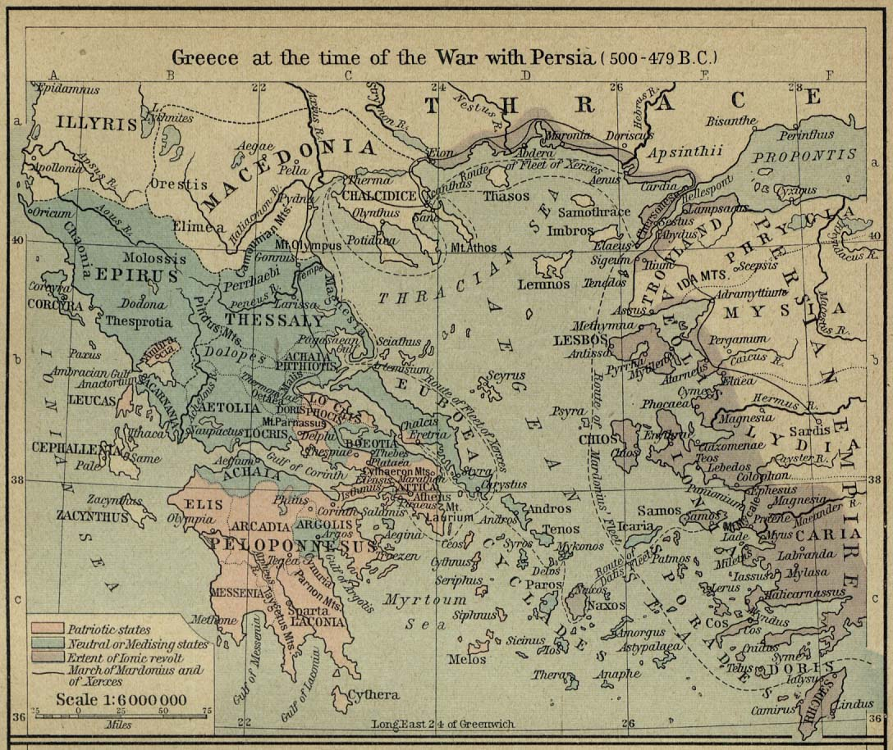

Bien sûr, voici la traduction de l'article en français, formatée en Markdown.

# L'Âge de la Polis : Une Étude de Sparte, Athènes, et des Guerres pour l'Hellas

## Introduction : Le Monde Renaissant de l'Effondrement

L'histoire de la Grèce classique ne commence pas dans le vide, mais émerge plutôt des cendres d'un profond effondrement sociétal. Le souvenir historique de l'époque précédente, l'âge du bronze, était celui de la Grèce mycénienne — un monde de palais fortifiés, de vastes réseaux commerciaux et de conflits épiques qui prirent fin de manière calamiteuse vers 1200 av. J.-C..[1, 2] La destruction de cet ordre ancien créa un vide historique, un « âge sombre » d'où allait naître une civilisation nouvelle et radicalement différente. Cette période de renaissance fut caractérisée par ce que l'on peut décrire comme une « innovation massive », une explosion créative qui jeta les bases intellectuelles, politiques et culturelles du monde occidental.[1]

Cet environnement post-effondrement favorisa trois développements fondamentaux qui allaient définir l'expérience hellénique. Le premier fut l'émergence d'une nouvelle unité politique et sociale : la *$polis$*, ou cité-État. Cette entité hautement localisée et indépendante devint la pierre angulaire de la société grecque pendant des siècles.[1, 2] Le deuxième fut l'adoption et l'adaptation de l'alphabet, qui entraîna une augmentation révolutionnaire de l'alphabétisation. Cette démocratisation de l'écrit permit de nouvelles formes de droit, d'histoire et d'enquête philosophique.[1] Enfin, le paysage culturel fut codifié par le poète épique Homère, dont les œuvres, l'*Iliade* et l'*Odyssée*, fournirent aux Grecs une mythologie partagée, un cadre éthique commun et des archétypes héroïques comme Achille, qui incarnait leurs valeurs les plus chères et les plus dangereuses.[1]

Ces innovations n'étaient pas de simples avancées déconnectées ; elles représentaient un changement fondamental vers la décentralisation. La structure hiérarchique, centrée sur les palais et descendante des Mycéniens fut remplacée par un vaste réseau de cités-États farouchement indépendantes. De même, les écritures complexes de l'âge du bronze, qui nécessitaient une classe spécialisée de scribes et centralisaient ainsi le savoir, cédèrent la place à un alphabet phonétique beaucoup plus accessible. Les caractéristiques déterminantes de la nouvelle ère hellénique étaient donc une inversion directe de l'ancien modèle centralisé de l'âge du bronze, favorisant l'intense identité locale et la féroce compétition entre États qui allaient caractériser toute la période classique.

## Section 1 : La Géographie comme Destin : Les Paysages des Hellènes

Pour comprendre les profondes divergences au sein du monde grec, il faut d'abord comprendre son environnement physique. Une thèse centrale pour interpréter cette période est l'affirmation puissante que « la géographie est le Destin ».[1] Ce concept, connu académiquement sous le nom de déterminisme environnemental, postule que le paysage physique est la principale variable dans la formation de la culture, de l'économie et de la structure politique d'une société.[1] La géographie de la Grèce — une mosaïque accidentée de chaînes de montagnes isolantes, de plaines fertiles, de rivières sinueuses et d'un littoral infiniment découpé — créa un laboratoire naturel où des modèles sociétaux disparates purent émerger et évoluer à proximité les uns des autres.[1, 3]

Cette topographie variée est essentielle pour comprendre les réalités stratégiques et les trajectoires culturelles des peuples helléniques. Une carte du monde égéen au Ve siècle av. J.-C. révèle le positionnement critique des principales puissances et localités qui allaient dominer l'histoire de l'époque.

Cette carte démontre visuellement le contraste frappant entre les deux cités-États dominantes vers 500 av. J.-C. Sparte est située au cœur de la péninsule du Péloponnèse, une puissance enclavée entourée par les plaines fertiles de Laconie. Athènes, en revanche, occupe la péninsule de l'Attique, une masse terrestre rocheuse et moins arable dotée d'un superbe port naturel, orientant son attention vers la mer Égée.[1, 4, 5] Ces deux *$poleis$* servent d'exemples classiques de la manière dont les pressions et les opportunités de l'environnement physique ont forgé deux civilisations diamétralement opposées.[1]

## Section 2 : Sparte : L'État Garnison Forgé par la Peur

La société spartiate était un État rigide, militariste et communautaire, et chaque aspect de son existence peut être compris comme une réponse à un impératif unique et primordial : le contrôle de sa massive population d'esclaves, les Hilotes.[1] La géographie de Sparte dans les plaines fertiles du Péloponnèse la rendait idéale pour l'agriculture, mais cette base agraire nécessitait une vaste main-d'œuvre. Par la conquête, Sparte soumit les populations voisines, créant le système des Hilotes. La statistique cruciale qui éclaire la psyché spartiate est le ratio estimé de 10 Hilotes pour 1 citoyen spartiate. Ce déséquilibre démographique créa un état de peur perpétuelle et latente, forçant Sparte à devenir une « société militaire afin de contrôler les hilotes ».[1]

Cette réalité fondamentale dicta la création de l'*Agoge*, un régime d'éducation et d'entraînement étatique brutal conçu non pas pour produire des individus équilibrés, mais pour forger les soldats les plus disciplinés du monde. À l'âge de sept ans, les garçons étaient retirés de leur famille et plongés dans une vie communautaire rude où ils étaient systématiquement endurcis et où on leur enseignait la « discipline émotionnelle » par la privation et la violence.[1] Adolescents, ils étaient jumelés à des guerriers plus âgés dans un système de mentorat qui, bien qu'impliquant des relations homosexuelles, était considéré par les Spartiates comme une méthode cruciale pour construire la « cohésion émotionnelle » et la loyauté au sein des rangs.[1] Même à l'âge adulte, les hommes spartiates menaient une vie collective, tenus de prendre leurs repas et de s'entraîner ensemble dans des salles communes, renforçant la primauté absolue de l'État sur l'individu ou la famille.[1]

Cette soumission de l'individu s'étendait à l'économie. La société spartiate était radicalement communautaire, dépourvue de propriété privée et de système monétaire. Comme le note le conférencier, « Tout, y compris les hilotes, appartient à tout le monde », un système que l'on peut décrire comme une forme de « proto-communisme ».[1] Cette structure économique était un outil délibéré pour éliminer la compétition interne, empêcher l'accumulation de richesses qui pourrait créer des factions, et concentrer toute l'énergie sociétale sur la sécurité de l'État. La conséquence de cette intense concentration interne fut une politique étrangère profondément conservatrice et isolationniste. Consumée par le maintien du contrôle et la répression des fréquentes rébellions d'Hilotes, Sparte n'avait « aucun intérêt pour... le monde extérieur à Sparte ».[1] Ils étaient pathologiquement résistants au changement, allant jusqu'à tuer leurs propres rois qui tentaient des réformes, et leur politique étrangère était un simple dicton : « si vous nous laissez tranquilles, nous vous laisserons tranquilles ».[1]

L'ensemble du système spartiate était conçu pour une stabilité et une force maximales contre une menace interne spécifique, créant un état d'équilibre fragile. Cette hyper-spécialisation, cependant, le rendait incapable de s'adapter à de nouveaux défis externes. La raison même du conservatisme extrême de Sparte était la fragilité inhérente de son ordre social. Tout changement significatif dans son économie, son armée ou sa structure sociale risquait de perturber l'équilibre délicat et brutal du pouvoir qui maintenait la population hilote sous contrôle. Comme une révolte d'Hilotes était une menace existentielle, l'appareil d'État était conçu pour empêcher le changement à tout prix, créant une société immensément puissante dans son contexte choisi mais qui finirait par se briser face à des problèmes que son système n'était pas conçu pour résoudre.

## Section 3 : Athènes : La Polis Compétitive Poussée par la Gloire

À presque tous les égards, Athènes était l'antithèse de Sparte. Son développement a été façonné par une géographie maritime qui a favorisé une culture de commerce, d'expansionnisme et une forme radicale d'individualisme encapsulée dans le concept d'*eudaimonia*.[1] Située sur la côte de l'Attique, une région vallonnée décrite comme « mauvaise pour les cultures » mais idéale pour la culture des oliviers et la production de poteries fines, Athènes était naturellement poussée vers la mer. Possédant un « très bon port », elle devint une « nation commerçante » dynamique, son regard tourné vers le monde entier.[1]

La valeur culturelle centrale qui animait cette société était l'*eudaimonia*, un terme grec signifiant « épanouissement humain » ou la volonté d'« être le meilleur que l'on puisse être ».[1] Cela créa une mentalité profondément différente de l'accent spartiate sur le collectif. L'archétype ultime de cet idéal était Achille, le héros de l'*Iliade* d'Homère. Comme le conférencier l'illustre puissamment, Achille s'est vu offrir un choix : une vie longue, paisible et anonyme, ou une vie courte et violente qui se terminerait par une gloire immortelle. Il choisit de « mourir jeune mais... en héros », incarnant la croyance athénienne qu'une vie sans gloire, sans atteindre son potentiel maximum, n'était pas une vie digne d'être vécue.[1] Cette quête universelle de l'*eudaimonia* fit d'Athènes une « société très compétitive », où les citoyens rivalisaient constamment pour être « le seul héros ». Cette pulsion était si intense qu'elle pouvait même justifier la trahison, comme lorsque Achille demanda à sa mère déesse que les dieux aident les Troyens ennemis, simplement pour prouver sa propre indispensabilité à l'armée grecque.[1]

Pour gérer les frictions intenses et le chaos potentiel de tant d'individus ambitieux, Athènes développa des mécanismes politiques uniques. Le premier était l'ostracisme, un processus par lequel les citoyens pouvaient voter pour bannir un individu pendant dix ans. Cela agissait comme une soupape de sécurité sociétale, éliminant les figures qui devenaient « trop compétitives » ou étaient perçues comme une menace pour l'État.[1] C'était considéré comme une punition « pire que la mort », car dans le monde grec, la citoyenneté était un droit de naissance exclusif. Être exilé, c'était être dépouillé de son identité et de ses droits, devenir un « personne ».[1] Le second mécanisme était la démocratie. Cependant, ce n'était pas un système d'égalité universelle mais principalement une « bataille entre différentes factions de la noblesse ».[1] Un argument historique clé est que les conflits sociétaux les plus importants ne sont pas entre les riches et les pauvres (les « nantis et les démunis »), mais entre l'élite établie (ceux qui « ont beaucoup ») et une classe montante et ambitieuse (ceux qui « ont un peu mais en veulent plus »), comme la basse noblesse ou une nouvelle classe marchande.[1]

L'idéal athénien de l'*eudaimonia* était une arme culturelle à double tranchant. C'était le moteur du dynamisme athénien, poussant ses citoyens à accomplir des exploits inégalés dans l'art, la philosophie, le commerce et la construction d'un empire. Il a alimenté l'ambition qui a vaincu les Perses et construit le Parthénon. Cependant, cette même quête incessante de gloire individuelle, lorsqu'elle n'était pas contrôlée, a favorisé l'hubris, la division interne et l'excès impérial qui allaient finalement conduire à l'autodestruction d'Athènes. La culture même qui a provoqué l'ascension fulgurante d'Athènes contenait les germes de sa chute spectaculaire.

### Tableau 1 : Un Conte de Deux Cités : Sparte contre Athènes (vers 500 av. J.-C.)

| Caractéristique | Sparte | Athènes |
| :--- | :--- | :--- |
| **Géographie** | Enclavée, plaines fertiles (Péloponnèse) | Côtière, terrain vallonné, port naturel (Attique) |
| **Économie** | Basée sur l'agriculture, dépendante du travail des esclaves | Basée sur le commerce, maritime, axée sur la poterie et les olives |
| **Système de travail** | Dominé par les Hilotes asservis (ratio de 10:1) | Mélange de citoyens, d'esclaves et de résidents étrangers |
| **Valeur fondamentale** | Sécurité collective, stabilité, conformité | *Eudaimonia* (épanouissement individuel), gloire |
| **Gouvernement** | Oligarchie (« gouvernement par quelques-uns »), conservateur | Démocratie (pour les citoyens), compétitive |
| **Militaire** | Armée de terre dominante (Hoplites) | Marine dominante |
| **Politique étrangère** | Isolationniste, insulaire, défensive | Expansionniste, impérialiste, agressive |
| **Structure sociale** | Rigide, militariste, propriété communautaire | Compétitive, individualiste, richesse privée |

## Section 4 : Les Guerres Médiques (490-479 av. J.-C.) : L'Unification de l'Hellas

Le conflit épique entre les cités-États grecques et l'Empire perse fut un moment décisif pour la civilisation hellénique. Cette menace extérieure forgea temporairement une identité panhellénique et modifia radicalement l'équilibre des pouvoirs, préparant finalement le terrain pour l'ascension d'Athènes à la domination.[3] La guerre commença avec la révolte ionienne (499-493 av. J.-C.), lorsque les cités grecques d'Asie Mineure se rebellèrent contre la domination perse.[6] Lorsqu'elles cherchèrent de l'aide, les réponses de Sparte et d'Athènes furent parfaitement conformes à leur caractère : Sparte refusa (« votre problème, pas le mien »), tandis qu'Athènes, poussée par la perspective de la gloire et de la richesse, accepta d'aider (« atteignons l'udonia, mec »).[1] Après avoir écrasé la révolte, le roi perse Darius Ier lança une invasion de la Grèce pour punir Athènes. Lors de la bataille de Marathon en 490 av. J.-C., une force athénienne plus petite remporta une victoire éclatante, démontrant la supériorité tactique de la phalange hoplitique lourdement blindée sur le terrain vallonné grec contre l'infanterie et la cavalerie perses plus légèrement armées.[1, 6]

Dix ans plus tard, en 480 av. J.-C., le fils de Darius, le roi Xerxès, revint avec une vengeance, menant l'une des plus grandes forces d'invasion que le monde antique ait jamais vues.[1, 7] Cette seconde invasion vit certaines des batailles les plus légendaires de l'histoire. Au col des Thermopyles, une petite force dirigée par 300 Spartiates fit un dernier combat héroïque, retardant l'avancée perse et devenant un symbole éternel de courage face à des forces écrasantes.[1, 6] Les Perses marchèrent ensuite vers le sud et incendièrent Athènes. Cependant, les Athéniens avaient déjà évacué leur population sur leurs navires de guerre, agissant selon le principe que la *$polis$* est sa communauté de citoyens, et non son emplacement physique.[1]

Le tournant de la guerre eut lieu en mer. Le général athénien Thémistocle conçut une stratégie brillante pour attirer l'énorme flotte perse dans les détroits étroits de Salamine. Dans les eaux confinées, l'avantage numérique des Perses fut annulé, et les navires grecs, plus lourds et plus manœuvrables, détruisirent systématiquement leur flotte.[1, 7] Cette victoire navale fut décisive, car elle paralysa les lignes de ravitaillement perses et força Xerxès à se retirer avec une grande partie de son armée. L'année suivante, en 479 av. J.-C., une armée grecque combinée sous commandement spartiate affronta les forces perses restantes à la bataille de Platées. Les Grecs remportèrent une autre victoire écrasante, tuant le commandant perse Mardonios et mettant fin pour de bon à la menace de conquête perse.[1, 6]

Les guerres médiques agirent comme un catalyseur sans précédent, non pas en créant les natures fondamentales d'Athènes et de Sparte, mais en accélérant considérablement leurs trajectoires inhérentes. Le conflit apporta à Athènes une immense richesse provenant des trésors capturés, un prestige inégalé en tant que sauveurs de la Grèce, et la justification militaire pour construire un empire naval. Pour Sparte, le quasi-désastre et les complexités de la campagne confirmèrent leurs craintes les plus profondes : que le monde extérieur au Péloponnèse était chaotique et constituait une menace profonde pour leur ordre interne fragile. La guerre, par conséquent, jeta de l'huile sur le feu de leurs identités culturelles existantes, poussant Athènes à devenir plus expansionniste et enfonçant Sparte plus profondément dans sa coquille isolationniste.

## Section 5 : L'Âge d'Or d'Athènes : De Libérateur à Tyran

Dans les cinquante années qui suivirent les guerres médiques, Athènes connut un épanouissement sans précédent de la culture, de la philosophie et de la démocratie. Cependant, cet « Âge d'Or » fut construit sur la transformation de la cité, de chef de file célébré des Grecs en une puissance impériale impitoyable. Le véhicule de cette transformation fut la Ligue de Délos, formée en 478 av. J.-C. comme une alliance défensive contre toute future menace perse.[7] Athènes, avec sa marine supérieure, dirigeait la ligue, tandis que les autres États membres contribuaient financièrement à un trésor commun sur l'île sacrée de Délos.[1] Au fil du temps, Athènes détourna l'objectif de la ligue. Elle empêcha par la force les membres de faire sécession, déplaça le trésor de Délos à Athènes, et commença à utiliser les fonds de la ligue à ses propres fins, transformant de fait l'alliance en « l'Empire athénien ».[1]

La figure politique dominante de cette époque fut Périclès, qui dirigea Athènes de 461 à 429 av. J.-C. et est souvent célébré comme le « père de la démocratie athénienne ».[1] Une analyse plus critique, cependant, révèle Périclès comme un maître politicien qui utilisa les réformes démocratiques comme des outils pour amasser et maintenir un pouvoir personnel. Son extension du droit de vote et l'introduction d'une rémunération pour le service public n'étaient pas de simples actes idéologiques ; c'étaient des manœuvres politiques habiles pour donner du pouvoir aux classes inférieures — sa principale base politique — aux dépens de la noblesse traditionnelle, faisant de lui le « roi de facto d'Athènes ».[1]

L'élément le plus frappant du règne de Périclès fut son utilisation du tribut impérial. Il rendit la « corruption officielle » en prenant le trésor de la Ligue de Délos et en le dépensant dans de massifs projets de travaux publics à Athènes, le plus célèbre étant le Parthénon.[1] Ces dépenses somptuaires servaient un double objectif : elles glorifiaient la cité et, plus important encore, elles fonctionnaient comme un programme de relance massif, fournissant des emplois aux artisans et aux ouvriers et des contrats lucratifs à ses partisans politiques. En substance, Périclès « soudoyait la cité d'Athènes » avec l'argent de ses sujets.[1] Lorsque ses rivaux politiques de la haute noblesse l'accusèrent de corruption et tentèrent de le faire ostraciser, Périclès utilisa son immense soutien populaire pour renverser la situation et faire exiler ses opposants, le laissant sans opposition politique significative.[1]

Les réalisations célébrées de cette période ne peuvent être séparées de l'exploitation impériale qui les a financées. Les indemnités démocratiques qui permettaient aux citoyens pauvres de participer au gouvernement, les sommes considérables qui ont construit les merveilles architecturales de l'Acropole, et l'activité économique dynamique qui a soutenu des philosophes comme Socrate et des dramaturges comme Sophocle étaient toutes directement subventionnées par le tribut exigé des alliés prétendument libres d'Athènes. Une contradiction fondamentale se trouve au cœur de l'Âge d'Or athénien : sa liberté interne reposait sur sa tyrannie externe.

## Section 6 : La Guerre du Péloponnèse (431-404 av. J.-C.) : Le Monde Grec se Tourne sur Lui-même

La guerre du Péloponnèse fut un conflit catastrophique de 27 ans entre Athènes et son empire et Sparte et sa Ligue du Péloponnèse qui déchira le monde grec.[3] Alors que l'explication traditionnelle, articulée par l'historien Thucydide, est que la guerre fut causée par la peur de Sparte face à la puissance montante d'Athènes, une vision révisionniste suggère une cause plus directe : Athènes était devenue un « grand tyran » impérial, et les autres États grecs, menés par Sparte, sentaient qu'ils n'avaient d'autre choix que de se battre ou d'être subjugués.[1] La guerre n'était pas seulement un conflit politique ; c'était une guerre civile profondément irrationnelle dont les stratégies défiaient souvent la logique militaire, suggérant qu'elle était davantage motivée par les dynamiques de classe internes des participants que par une politique d'État rationnelle.

Les stratégies militaires employées par les deux camps étaient, d'un point de vue purement objectif, insensées. Athènes, avec sa suprématie navale, aurait pu facilement débarquer des forces dans le Péloponnèse pour armer les Hilotes et inciter à une rébellion — la plus grande et la plus paralysante peur de Sparte. Pourtant, ils ne se sont jamais engagés dans cette stratégie qui aurait pu gagner la guerre.[1] Inversement, la seule voie logique pour Sparte pour constituer une armée assez grande pour défier les vastes ressources d'Athènes était d'offrir la liberté aux Hilotes en échange d'un service militaire. Ils refusèrent de le faire jusqu'à ce que la guerre soit presque perdue.[1] La stratégie initiale de Périclès pour Athènes fut tout aussi désastreuse. Il choisit d'éviter les batailles terrestres et de cacher toute la population de l'Attique derrière les murs de la ville, un plan qui conduisit à une peste dévastatrice qui tua un tiers de la population, y compris lui-même et ses fils — un résultat bien pire que toute défaite probable sur le champ de bataille.[1]

Cette irrationalité omniprésente suggère que la fonction première de la guerre était interne. La noblesse dirigeante à Athènes et à Sparte ne cherchait pas vraiment une victoire totale, car une telle victoire aurait donné du pouvoir à de nouvelles classes de personnes et aurait radicalement bouleversé l'ordre social. Au lieu de cela, ils étaient engagés dans un conflit prolongé qui servait à « maintenir le statu quo » en fournissant un champ de bataille pour tuer la « basse noblesse » ambitieuse et agitée, les hommes mêmes qui poussaient à une guerre agressive et défiaient la hiérarchie établie.[1] La mort commode des deux leaders populistes les plus agressifs et les plus victorieux de la guerre — Cléon d'Athènes et Brasidas de Sparte — dans la même bataille est présentée comme très suspecte, avec une forte possibilité qu'ils aient été assassinés par leurs propres camps, qui craignaient leur succès plus qu'ils ne craignaient l'ennemi.[1]

La guerre prit fin après que l'Empire perse, jouant le rôle de faiseur de rois, intervint et donna à Sparte l'argent pour construire une marine.[1] Ceci, combiné à la promotion du brillant mais de basse extraction commandant Lysandre, permit à Sparte de vaincre finalement Athènes en 404 av. J.-C. Pourtant, la conclusion de la guerre fut bizarre. Malgré 27 ans de combats brutaux, Sparte refusa les demandes de ses alliés de détruire complètement Athènes. L'explication de cette clémence déroutante est que la haute noblesse de Sparte et d'Athènes étaient, en un sens, de « bons amis » appartenant à la même classe transnationale. Ils comprenaient que leurs vrais ennemis n'étaient pas les uns les autres, mais les classes inférieures ambitieuses au sein de leurs propres cités. La guerre peut ainsi être interprétée comme un sinistre mécanisme homéostatique pour une société stratifiée. Face à la pression interne d'une classe inférieure montante et ambitieuse, les élites dirigeantes de la Grèce se sont engagées dans un conflit prolongé et mutuellement destructeur qui a servi de « purge » violente de ces éléments déstabilisateurs, restaurant ainsi l'équilibre social d'avant-guerre à un coût horrible.

## Section 7 : Une Thèse Provocatrice : L'Utopie des Rats et les Périls de l'Abondance

Pour expliquer le comportement apparemment insensé et autodestructeur des Grecs pendant la guerre du Péloponnèse, une théorie socio-biologique provocatrice peut être appliquée, encadrant le conflit comme le symptôme d'une maladie sociétale plus profonde causée par un excès de richesse et de stabilité. Cette théorie est basée sur les expériences de l'« Utopie des Rats » menées par l'éthologue John B. Calhoun dans les années 1960 et 1970.[1] Calhoun créa un environnement parfait pour une colonie de rats — un habitat sans maladie avec de la nourriture et de l'eau illimitées, et sans prédateurs, conçu pour être un paradis.

Le résultat, cependant, ne fut pas une utopie mais un effondrement sociétal complet, un phénomène que Calhoun nomma le « gouffre comportemental ». Bien que tous leurs besoins matériels fussent satisfaits, les rituels sociaux complexes des rats, tels que la parade nuptiale et l'élevage des jeunes, s'effondrèrent entièrement. Les mâles devinrent hyper-agressifs, formant des gangs violents qui attaquaient les femelles et les jeunes. Les mères, traumatisées et abandonnées, se retournèrent contre leur propre progéniture. Les rôles sociaux se désintégrèrent, et la population plongea dans un vortex de violence, de déviance sexuelle et de nihilisme, menant finalement à l'extinction de toute la colonie.[1]

L'explication de cet effondrement n'était pas la surpopulation, mais une crise de statut et de but. Dans un monde d'abondance sans effort, les rats plus âgés et établis vivaient plus longtemps, monopolisant les positions de pouvoir et de dominance sociale. Cela « verrouillait » la hiérarchie sociale, empêchant les jeunes mâles de trouver des rôles significatifs, de rivaliser pour le statut ou de gravir l'échelle sociale. Avec toutes leurs pulsions biologiques pour la compétition et l'avancement contrecarrées, leur énergie frustrée se tourna vers l'intérieur, entraînant l'effondrement complet de leur société.[1]

Ce modèle peut être appliqué directement au monde grec du Ve siècle av. J.-C. La période suivant les guerres médiques, avec son afflux de trésors perses et la sécurité relative de l'empire athénien, créa les conditions d'« abondance » et de « richesse » analogues à l'expérience des rats.[1] Cette prospérité, selon la théorie, créa un scénario d'« Utopie des Rats » où les ambitions de la jeune génération et de la basse noblesse étaient bloquées par une élite bien établie. La guerre du Péloponnèse, par conséquent, peut être interprétée comme l'équivalent humain du « gouffre comportemental » — une orgie de violence prolongée et insensée qui fut le résultat inévitable d'une société devenue trop prospère pour son propre bien, où une génération sans grand ennemi extérieur à combattre se retourna contre elle-même.[1] L'ensemble du récit historique, de l'effondrement de l'âge du bronze à la fin de la guerre du Péloponnèse, forme ainsi un grand modèle déterministe en plusieurs étapes. La géographie fixe les conditions culturelles initiales ; ces cultures dictent les trajectoires politiques et militaires ; le succès mène à une condition d'abondance ; et cette abondance déclenche un « mécanisme de sécurité » socio-biologique d'autodestruction.

## Conclusion : Le Climax Autodestructeur de l'Âge Classique

L'histoire de la Grèce classique est un arc dramatique de naissance, d'épanouissement et d'auto-immolation sociétale. Du monde innovant qui est né des cendres de l'effondrement de l'âge du bronze, deux pôles de civilisation contrastés ont émergé : Sparte, l'État garnison insulaire forgé par la peur, et Athènes, la puissance maritime expansionniste animée par la quête de la gloire individuelle. Pendant un bref et brillant moment, la menace existentielle de l'Empire perse a uni ces États disparates, menant à une victoire qui a assuré l'avenir de la civilisation hellénique et a propulsé Athènes dans un Âge d'Or de réalisations culturelles inégalées.

Pourtant, la pulsion culturelle athénienne pour l'*eudaimonia*, le moteur même de sa grandeur, s'est avérée être une faille tragique. Elle a alimenté une hubris impériale qui a transformé Athènes de libérateur en tyran, menant finalement à la guerre du Péloponnèse — un conflit qui a opposé Grec contre Grec dans une lutte de plusieurs décennies pour la suprématie. Les stratégies apparemment irrationnelles de la guerre et sa conclusion déroutante suggèrent qu'il s'agissait moins d'un conflit rationnel entre États que d'une purge interne brutale conçue pour préserver une hiérarchie sociale rigide contre les ambitions d'une classe montante.

Enfin, la thèse provocatrice de l'« Utopie des Rats » offre une perspective troublante pour voir cet effondrement. Elle postule que la guerre du Péloponnèse n'était pas un simple échec politique, mais le symptôme d'une société se décomposant sous le poids de son propre succès. La richesse et la stabilité acquises par la victoire sur la Perse ont créé un monde sans but pour une nouvelle génération, dont les énergies frustrées ont éclaté en une violence nihiliste. L'histoire de la Grèce du Ve siècle sert ainsi de conte intemporel et édifiant sur la manière dont les facteurs mêmes qui mènent une civilisation à son apogée peuvent, en fin de compte, déclencher son propre déclin tragique et inévitable.