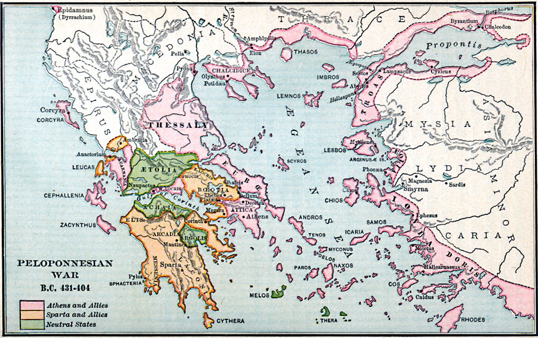

Bien sûr, voici la traduction de l'article en français, formatée en Markdown.

# Le Théâtre de la Démocratie : Identité Civique et Enquête Morale dans l'Athènes du Ve Siècle

## Introduction : La Scène comme École de la *Polis*

Chaque société est confrontée au défi fondamental de façonner la conscience collective de son peuple, de forger une identité partagée à partir d'une multitude d'individus.[1] Dans le monde moderne, cette tâche est largement entreprise par un triumvirat d'institutions : les écoles publiques, qui transmettent une base commune de connaissances et d'histoire ; les médias de masse, qui cadrent une vision particulière du monde ; et le divertissement de masse, qui cultive une culture nationale.[1] Cependant, dans le creuset de l'Athènes du Ve siècle avant notre ère, cette fonction civique essentielle était remplie par une seule institution révolutionnaire : le théâtre. Loin d'être un simple divertissement, le théâtre athénien était le moteur de sa démocratie, un espace sacré et civique où l'ensemble du corps citoyen se rassemblait pour examiner collectivement les questions morales, politiques et existentielles de leur temps. C'est là, dans les grands amphithéâtres en plein air, que les Athéniens apprenaient ce que signifiait être un citoyen démocratique — les responsabilités, les privilèges et les profonds défis inhérents à un système d'autogouvernance.[1]

Les architectes de ce discours public étaient les grands tragédiens, vénérés non seulement comme des artistes, mais comme les principaux enseignants et « prophètes de la démocratie » de la cité.[1] À travers leurs œuvres dramatiques, ils guidaient le peuple athénien dans une enquête soutenue sur la nature de la justice, les limites du pouvoir et la signification de leur expérience politique unique. Les trois titans de cette époque — Eschyle, Sophocle et Euripide — représentent chacun une phase distincte de l'évolution de la conscience de soi d'Athènes. Leurs carrières retracent l'arc dramatique de la cité elle-même, de l'optimisme triomphant après les guerres médiques aux complexités morales du pouvoir impérial et au traumatisme final de la guerre du Péloponnèse. En examinant leurs principales œuvres survivantes, on peut cartographier le parcours intellectuel et éthique de la première démocratie du monde alors qu'elle se débattait avec ses propres idéaux et contradictions sur la scène publique.

| Dramaturge | Dates Clés | Principales Œuvres Survivantes Discutées | Axe Thématique Principal | Innovation Clé |
| :--- | :--- | :--- | :--- | :--- |
| **Eschyle** | c. 525–456 av. J.-C. [2, 3] | La trilogie de *L'Orestie* (458 av. J.-C.) [4, 5] | L'évolution de la vengeance par le sang à la justice civique ; les origines divines de la démocratie. | Introduction du deuxième acteur, augmentant le dialogue dramatique.[3] |
| **Sophocle** | c. 496–406 av. J.-C. [6, 7] | *Antigone* (c. 442 av. J.-C.) [8] | Le conflit entre la loi divine et la loi humaine ; les dangers de l'hubris et de la tyrannie. | Introduction du troisième acteur ; développement complexe des personnages.[6] |
| **Euripide** | c. 484–406 av. J.-C. [7, 9] | *Les Troyennes* (415 av. J.-C.), *Les Bacchantes* (405 av. J.-C.) [10] | Critique de la guerre et de l'empire ; réalisme psychologique ; remise en question des valeurs traditionnelles. | Protagonistes féminines fortes ; mélange d'éléments tragiques et comiques.[11] |

## Partie I : Le Cœur Civique et Religieux d'Athènes - Le Festival de Dionysos

Pour comprendre le pouvoir de la tragédie athénienne, il faut d'abord comprendre le contexte unique dans lequel elle est née et a été jouée. Les pièces n'étaient pas des entreprises commerciales mises en scène pour le profit, mais étaient la pièce maîtresse des **Grandes Dionysies**, un festival annuel parrainé par l'État qui était à la fois un rite religieux profond, une célébration civique vibrante et une formidable démonstration de la puissance culturelle et politique athénienne.[5] Cette fusion du sacré et du profane créait un environnement où le drame pouvait aborder les questions les plus pressantes de la *polis* avec une autorité et une portée inégalées.

### Signification Religieuse et Civique

Les Grandes Dionysies, ou Dionysies urbaines, se tenaient chaque printemps vers la fin mars, une période où les mers d'hiver redevenaient navigables, permettant aux alliés, ambassadeurs et marchands de tout l'Égée d'affluer à Athènes.[5, 12] Ce moment n'était pas un hasard ; il transformait le festival en une vitrine de la grandeur athénienne. Alors que les alliés sujets arrivaient pour payer leur tribut annuel, ils étaient accueillis par une ville engagée dans une magnifique célébration de sa richesse, de son génie artistique et de sa vitalité démocratique.[5] Le festival était fondamentalement un événement religieux en l'honneur de Dionysos, le dieu du vin, de la fertilité et de la libération extatique — une divinité qui représentait la dissolution des frontières ordinaires et l'exploration de vérités plus profondes.[1, 5] Les festivités commençaient par une grande procession, la *pompē*, au cours de laquelle une statue sacrée en bois de Dionysos était promenée à travers la ville jusqu'au théâtre, accompagnée de citoyens vêtus de couleurs vives, de grands symboles phalliques et d'animaux destinés au sacrifice.[5, 13]

La structure du festival était profondément ancrée dans l'idéologie démocratique de la cité. L'événement entier était organisé et financé par l'État, avec un magistrat en chef, l'*archonte*, supervisant les débats.[5] Une caractéristique démocratique clé était le système de financement des pièces. Des citoyens riches étaient choisis pour servir de *chorèges* (producteurs), payant pour la formation du chœur et les coûts de production de l'œuvre d'un dramaturge. C'était une forme de liturgie — un service public — qui permettait à l'élite de montrer son patriotisme et de gagner la faveur du public, tout en garantissant que les pièces restent accessibles à tous.[1, 5] En effet, l'entrée était gratuite pour tous les citoyens, et l'État fournissait même une subvention pour s'assurer que les pauvres puissent y assister sans perdre une journée de salaire. La nature compétitive du festival renforçait encore son caractère démocratique. Trois dramaturges étaient sélectionnés par l'*archonte* pour présenter une tétralogie (trois tragédies et une pièce satyrique). Le gagnant n'était pas choisi par un panel d'élite mais par un jury de dix citoyens, tirés au sort parmi les dix tribus d'Athènes.[1, 5] Même les interprètes étaient des citoyens, et non une classe distincte d'acteurs professionnels, sélectionnés dans la communauté pour participer à ce grand événement civique.[1] Le privilège d'assister au théâtre était considéré comme l'un des plus grands droits de naissance d'un citoyen athénien.[1]

### L'Espace Théâtral : Architecture et Acoustique

L'espace physique où se déroulait cette expérience communautaire était aussi révolutionnaire que les pièces elles-mêmes. Le Théâtre de Dionysos, niché sur le versant sud de l'Acropole, était un immense amphithéâtre en plein air capable d'accueillir jusqu'à 17 000 spectateurs — une fraction significative de la population citoyenne totale d'Athènes, estimée à pas plus de 50 000 personnes.[1, 5] La forme architecturale, qui est devenue le modèle des théâtres du monde antique, était une œuvre magistrale d'ingénierie empirique. Les constructeurs utilisaient la pente naturelle de la colline pour créer une zone de sièges en gradins et semi-circulaire (le *theatron*) qui offrait des lignes de vue claires sur l'espace de performance circulaire en contrebas, l'*orchestra*.[14]

Les propriétés acoustiques de ces théâtres étaient remarquables. La conception concave et inclinée captait et concentrait le son, créant une résonance naturelle qui permettait à une voix humaine non amplifiée de porter jusqu'aux rangées les plus élevées.[1, 14] Des études scientifiques récentes ont révélé un niveau de sophistication encore plus grand. Des recherches sur le théâtre bien conservé d'Épidaure ont montré que les rangées de sièges en calcaire fonctionnent comme un « filtre acoustique » très efficace.[15] La surface ondulée des sièges en pierre diffuse les sons de basse fréquence, comme le murmure de la foule, tout en réfléchissant efficacement les sons de haute fréquence des voix des acteurs vers le public. Cet effet est renforcé par un phénomène psychoacoustique connu sous le nom de « hauteur virtuelle », où le cerveau reconstruit les fréquences fondamentales manquantes d'une voix à partir de ses harmoniques audibles, ce qui donne une perception de parole riche et claire.[15] Bien que les récits populaires selon lesquels on pouvait entendre une épingle tomber depuis la dernière rangée soient probablement apocryphes, des tests rigoureux confirment qu'une voix bien projetée — comme les acteurs grecs étaient formés à le faire — pouvait être entendue et comprise avec clarté dans tout le lieu.[15, 16] Cette expérience auditive était en outre soutenue par le fait que le public était intimement familier avec les mythes dramatisés, ayant souvent mémorisé des répliques clés, faisant de la performance un rituel profondément participatif et communautaire.[1]

La conception même du théâtre était une expression architecturale de l'idéologie démocratique. Contrairement aux espaces clos et hiérarchiques d'une cour royale ou du sanctuaire intérieur d'un temple, l'amphithéâtre était ouvert, inclusif et construit pour une expérience partagée et simultanée. Il rassemblait physiquement le *demos* en un seul corps, tous concentrés sur la même performance, tous entendant les mêmes mots, tous engagés dans le même acte collectif de contemplation. La technologie du théâtre — ses lignes de vue et son acoustique — n'était pas simplement une solution technique mais un outil politique, créant l'espace physique idéal pour forger l'identité collective que les pièces elles-mêmes cherchaient à explorer.[1] C'était un espace construit non pour le divertissement privé d'un monarque, mais pour l'éducation publique d'une citoyenneté.

## Partie II : Eschyle et la Naissance de la Justice - L'*Orestie*

La voix fondatrice de la tragédie athénienne appartient à **Eschyle** (c. 525–456 av. J.-C.), le plus ancien des trois grands maîtres dont l'œuvre nous est parvenue.[3, 7] Eschyle était un homme de la génération qui a forgé la démocratie athénienne et l'a défendue contre l'Empire perse. Il a combattu dans les batailles décisives des guerres médiques, et sa pierre tombale commémorait célèbre son service en tant que soldat à Marathon plutôt que ses réalisations en tant que dramaturge.[3, 7] Son œuvre est par conséquent imprégnée d'un profond sentiment de fierté civique et d'une croyance en la destinée divinement sanctionnée d'Athènes. Cette vision trouve son expression ultime dans son chef-d'œuvre, la trilogie de *L'Orestie*, jouée pour la première fois en 458 av. J.-C.[4, 17] Cette œuvre monumentale est plus qu'une simple relecture d'un mythe sinistre ; c'est une charte fondatrice de la démocratie athénienne, dramatisant l'évolution de la justice, de la vengeance primitive par le sang à l'ordre rationnel et miséricordieux du tribunal civique.

### Résumé de l'Intrigue de *L'Orestie*

La trilogie relate la malédiction de la maison d'Atrée, une famille piégée dans un cycle incessant de violence intestine.
*   ***Agamemnon*** : La première pièce s'ouvre sur le retour triomphal du roi Agamemnon à son palais d'Argos après dix ans de guerre de Troie. Sa victoire est creuse. Il est accueilli par sa femme, Clytemnestre, qui feint un accueil chaleureux mais bouillonne de ressentiment pour le sacrifice de leur fille, Iphigénie, au début de la guerre. Dans un dénouement glaçant, elle et son amant, Égisthe, assassinent Agamemnon dans son bain, prenant le contrôle du royaume.[1, 17]
*   ***Les Choéphores*** : La deuxième pièce se concentre sur les enfants survivants d'Agamemnon, Électre et Oreste. Oreste, exilé enfant, retourne secrètement à Argos. Il retrouve sa sœur près de la tombe de leur père et, poussé par le devoir de venger son père et par un ordre direct du dieu Apollon, il pénètre dans le palais et tue Égisthe et, à contrecœur, sa propre mère, Clytemnestre.[1, 17] Cet acte de matricide, bien que juste dans un sens, est une profonde violation de la loi naturelle. À la fin de la pièce, Oreste devient fou, poursuivi par les Furies (les *Érinyes*), de terrifiantes divinités chtoniennes anciennes qui punissent ceux qui versent le sang de leurs parents.[17, 18]
*   ***Les Euménides*** : La dernière pièce s'ouvre avec Oreste cherchant refuge contre les Furies au temple d'Apollon à Delphes. Apollon peut le protéger mais ne peut le purifier de sa culpabilité. Le dieu lui ordonne de se rendre à Athènes et de faire appel à la déesse Athéna.[4, 17] C'est à Athènes que le cycle de la violence est enfin brisé. Athéna, la déesse de la sagesse, établit une nouvelle institution pour résoudre le conflit : un tribunal, l'Aréopage, composé d'un jury de douze citoyens athéniens.[1, 4, 17]

### Analyse Thématique : De la Vengeance à la Loi

*L'Orestie* met en scène une lutte cosmique et politique entre deux conceptions concurrentes de la justice. Les Furies, qui se décrivent comme des « dieux anciens », représentent la loi archaïque et tribale de la vengeance par le sang — un système absolu et impitoyable où un acte violent en engendre inévitablement un autre dans un cycle perpétuel.[1, 18] Apollon, un « dieu jeune », représente un principe plus récent basé sur l'honneur patriarcal et l'ordre rationnel, mais sa justice est également absolue, rendue par commandement divin sans place pour la nuance ou la délibération humaine.[1, 18] Le dénouement révolutionnaire de la trilogie est l'invention d'une troisième voie, une solution uniquement athénienne : la justice civique.

L'intervention d'Athéna est le tournant. Elle n'impose pas un verdict divin. Au lieu de cela, elle donne le pouvoir aux mortels, créant un processus humain basé sur l'argumentation, les preuves et la délibération par un jury de pairs.[1, 17] Au procès, les Furies agissent en tant que procureurs, et Apollon sert d'avocat de la défense. Les arguments sont convaincants des deux côtés, reflétant la profonde ambiguïté morale de l'acte d'Oreste.[1] Le jury de citoyens est finalement dans l'impasse, partagé à six contre six. Athéna jette alors le vote décisif pour acquitter Oreste.[1, 17] Son vote n'est pas arbitraire ; il représente un choix philosophique délibéré de favoriser la raison, la persuasion et la miséricorde sur le cycle sans fin de la rétribution. La trilogie se termine par un autre acte de persuasion. Athéna ne détruit pas les Furies enragées mais les convainc d'accepter un nouveau rôle honoré au sein de la cité. Elles sont transformées en *Euménides*, ou « Bienveillantes », devenant des protectrices bienfaisantes d'Athènes, symbolisant l'intégration réussie des passions humaines primales dans l'ordre rationnel et juste de la *polis*.[17]

Pour le public athénien, le message était direct et profond. Leur système juridique, en particulier le tribunal vénéré de l'Aréopage, n'était pas simplement une invention humaine mais un don de leur déesse patronne.[4] La pièce servait de puissant outil de propagande civique, enseignant que participer au processus légal, servir dans un jury, c'était exercer un pouvoir semblable à celui des dieux eux-mêmes — le pouvoir de mettre fin aux cycles de violence et d'apporter la justice et la droiture dans le monde.[1]

Cet argument idéologique est puissamment renforcé par la géographie de la pièce. Le voyage d'Oreste dans la dernière pièce cartographie l'évolution même de la justice. L'action se déplace d'Argos, siège des anciens rois mycéniens et site de la vendetta primale et aristocratique [1] ; à Delphes, le centre religieux panhellénique représentant l'autorité de l'oracle divin [4] ; et enfin, à Athènes. Ce n'est pas une tournée aléatoire de la Grèce. C'est une relocalisation symbolique du concept de justice lui-même. Eschyle déplace physiquement la résolution de la condition humaine loin des anciens mondes de dynasties maudites et d'édits religieux absolus et la place carrément au sein des nouvelles institutions démocratiques d'Athènes. La logique spatiale de la pièce dit à son public : la vraie justice ne réside pas dans le passé ou dans des sanctuaires lointains ; elle vit *ici*, dans *notre* cité, et elle est mise en œuvre par *notre* action civique collective. Athènes est ainsi présentée comme l'aboutissement moral et intellectuel de la civilisation hellénique.

## Partie III : Sophocle et les Périls du Pouvoir - Les Pièces Thébaines

Si Eschyle célébrait la fondation glorieuse de l'ordre démocratique, son successeur **Sophocle** (c. 496–406 av. J.-C.) a consacré sa carrière à explorer ses tensions internes, ses complexités morales et son potentiel d'autodestruction.[6, 7] Sophocle a écrit pendant l'apogée de la puissance athénienne, une période de confiance et d'expansion impériale sans précédent connue sous le nom de Siècle de Périclès. Pourtant, ses pièces ne sont pas triomphalistes. Au contraire, ce sont des examens profonds et souvent troublants de la condition humaine, se concentrant sur la collision entre la volonté individuelle et le destin cosmique, et le danger toujours présent de l'arrogance humaine. Sa tragédie *Antigone*, jouée pour la première fois vers 442 av. J.-C., reste une exploration intemporelle et cinglante du conflit entre l'autorité de l'État et les diktats de la conscience individuelle — un puissant avertissement contre la tyrannie qui peut survenir lorsque l'orgueil d'un chef éclipse la sagesse et la justice.[8, 19]

### Contexte Mythologique et Résumé de l'Intrigue d'*Antigone*

La pièce se déroule au lendemain d'une guerre civile catastrophique dans la cité de Thèbes. Les deux fils du roi maudit Œdipe, Étéocle et Polynice, se sont battus pour le contrôle du trône et se sont entretués en combat singulier.[1, 19] Le nouveau souverain est leur oncle, Créon. Cherchant à établir son autorité et à faire un exemple du traître, Créon publie un décret : Étéocle, qui est mort en défendant Thèbes, sera enterré avec tous les honneurs militaires. Polynice, qui a mené une armée étrangère contre sa propre cité, doit être laissé sans sépulture sur le champ de bataille, son corps exposé pour être dévoré par les oiseaux et les chiens — une punition d'une extrême sévérité dans la croyance religieuse grecque, car elle refusait à l'âme la paix dans l'au-delà.[1, 19]

Antigone, sœur des deux frères morts, est horrifiée par cet édit. Elle croit que c'est une violation des lois sacrées et non écrites des dieux, qui commandent que tous les morts reçoivent des rites funéraires appropriés.[1, 8] Lors d'une réunion secrète, elle tente de solliciter l'aide de sa sœur plus timide, Ismène, qui refuse, craignant la colère du roi. Sans se décourager, Antigone agit seule, accomplissant un enterrement symbolique pour Polynice. Lorsqu'elle est découverte et amenée devant Créon, elle admet sa culpabilité avec défi, arguant que son devoir envers les dieux et sa famille transcende toute loi mortelle.[1, 19]

Enragé par ce défi à son autorité, le rigide et absolu Créon la condamne à être emmurée vivante dans une grotte. Son fils, Hémon, qui est fiancé à Antigone, supplie son père d'être miséricordieux, l'avertissant que les citoyens de Thèbes sympathisent avec Antigone.[1, 19] Créon rejette furieusement le conseil de son fils. Le prophète aveugle Tirésias arrive alors, délivrant un avertissement terrifiant que les dieux sont irrités par les actions de Créon et qu'il paiera son impiété avec la vie de son propre enfant.[19] Terrifié, Créon cède finalement et se précipite pour libérer Antigone, mais il est trop tard. Il découvre qu'elle s'est pendue. Hémon, pleurant sur son corps, tente de tuer son père puis retourne son épée contre lui-même. La nouvelle parvient au palais, et la femme de Créon, la reine Eurydice, se suicide également, maudissant son mari avec son dernier souffle. La pièce se termine avec Créon, un homme complètement brisé, berçant le corps de son fils et se lamentant de la ruine que son propre orgueil a provoquée.[1, 19]

### Analyse Thématique : Loi Humaine contre Loi Divine

Le drame central d'*Antigone* est le choc irréconciliable entre deux impératifs moraux concurrents. Créon est le champion de la loi humaine, le *nomos* de l'État. Il soutient, non sans raison, que l'ordre civique dépend de l'obéissance absolue au souverain. Pour lui, la stabilité et la sécurité de la *polis* sont le bien suprême, et tout acte de défi, surtout au lendemain d'une guerre civile, est une menace existentielle qui doit être écrasée.[8, 19] Antigone, en revanche, incarne les revendications de la loi divine et naturelle, ou *physis*. Elle répond à une autorité supérieure — les « grandes traditions non écrites et inébranlables » des dieux — qui dictent que les liens de parenté et les devoirs sacrés envers les morts sont immuables et ne peuvent être annulés par le décret d'aucun souverain mortel.[1, 8, 19] La pièce devient ainsi un texte fondateur du concept de désobéissance civile, forçant son public à affronter les limites du pouvoir de l'État et à se demander s'il existe des principes pour lesquels un individu est moralement obligé de défier la loi.[8]

Bien qu'Antigone soit l'héroïne de la pièce, la véritable figure tragique est Créon. Sa chute n'est pas le résultat de la méchanceté mais d'une faille fatale : l'*hubris*. Ce n'est pas une simple fierté, mais une arrogance violente et excessive qui fait croire à un homme qu'il est l'égal des dieux.[1] Créon confond sa volonté personnelle avec la loi de l'État et l'ordre de l'univers. Il est sourd à tout conseil, rejetant les supplications de son fils comme une folie de jeunesse, les préoccupations de ses citoyens comme le règne de la populace, et les avertissements du prophète comme une prophétie corrompue.[1, 19] Sa tragédie est une conséquence directe de son inflexibilité tyrannique. Pour un public athénien, profondément méfiant de la monarchie et de toute forme de gouvernement par un seul homme, le sort de Créon servait de leçon politique puissante et immédiate : voilà ce qui arrive lorsque le pouvoir n'est pas tempéré par la sagesse, la modération et la volonté d'écouter.[1]

La pièce n'offre pas de résolution simple ni de morale facile. Sa puissance durable réside dans le fait qu'il ne s'agit pas d'un conflit direct entre le bien et le mal, mais d'une tragédie née de la collision de deux revendications contradictoires, et en un sens valides, au « bien ». Le désir de Créon d'établir l'ordre et de punir la trahison est une préoccupation légitime pour un souverain. L'engagement d'Antigone envers son devoir religieux est un impératif moral absolu. La tragédie naît parce que ces deux « droits » sont mutuellement exclusifs et que leurs partisans sont trop absolus pour chercher un compromis. Sophocle ne fournit pas à son public une réponse simple ; il leur présente la question politique et éthique la plus difficile possible. Quel est le juste équilibre entre la sécurité de l'État et la liberté de l'individu? Quand le respect de la loi devient-il une injustice?

De cette manière, la pièce fonctionne comme un test de résistance sophistiqué pour l'éthos démocratique athénien. Elle révèle les points de rupture potentiels au sein de tout système politique. Pour un peuple se gouvernant lui-même, c'était une expérience de pensée vitale. Elle les forçait à affronter les tensions inhérentes entre le pouvoir de l'État et la conscience du citoyen, entre les exigences du présent et l'autorité de la tradition. *Antigone* est une leçon sur les vertus démocratiques essentielles que sont l'humilité, l'empathie et le débat raisonné — les qualités mêmes nécessaires pour empêcher un État de se durcir en tyrannie et un chef de succomber à l'aveuglement destructeur de son propre hubris.

## Partie IV : Euripide, le Critique de l'Empire

Le dernier et le plus controversé des grands tragédiens fut **Euripide** (c. 484–406 av. J.-C.).[7, 11, 20] Sa carrière s'est déroulée presque entièrement pendant la longue, corrosive et finalement catastrophique **guerre du Péloponnèse (431–404 av. J.-C.)**, un conflit qui a opposé Athènes à Sparte et a déchiré le monde grec.[21, 22] Tandis qu'Eschyle célébrait la justice athénienne et que Sophocle mettait en garde contre les failles internes, Euripide tendait un miroir à une Athènes en crise. Ses pièces sont souvent cinglantes, psychologiquement réalistes et profondément critiques des ambitions impériales de la cité et de la décadence morale engendrée par des décennies de guerre brutale. Il a remis en question les valeurs traditionnelles, défié les mythes héroïques et donné la parole aux marginalisés — en particulier les femmes — d'une manière qui était à la fois choquante et profondément moderne pour ses contemporains.[11, 20]

### Contexte Historique : La Guerre du Péloponnèse et l'Impérialisme Athénien

Pour comprendre l'œuvre d'Euripide, il faut saisir le profond changement idéologique qui s'est produit à Athènes pendant la guerre du Péloponnèse. Le conflit a commencé avec une vague de ferveur patriotique, mieux capturée dans la célèbre Oraison Funèbre prononcée par le dirigeant athénien Périclès en 431 av. J.-C. Telle que rapportée par l'historien Thucydide, ce discours est une magnifique articulation de l'idéal athénien. Périclès dépeint Athènes comme un phare de la civilisation, une démocratie ouverte, tolérante et intellectuellement vibrante qui se présente comme une « école de l'Hellas ».[1, 23, 24] Il soutient que les Athéniens se soumettent à la loi non par peur, mais par un désir partagé de liberté, et que les jeunes hommes qui meurent en défendant cette glorieuse cité trouvent un vrai sens dans leur sacrifice.[1, 23, 25] Cette oraison représente le sommet de la confiance en soi athénienne, le récit officiel d'un empire juste et noble.

Quinze ans plus tard, la réalité de cet empire était radicalement différente. En 416 av. J.-C., Athènes a envoyé une force navale sur la petite île neutre de Mélos et a exigé qu'elle rejoigne son alliance et paie un tribut. Les Méliens ont refusé, invoquant leur droit de rester neutres. Thucydide rapporte les négociations glaçantes qui ont suivi dans son « Dialogue mélien ». Les envoyés athéniens se dispensent de toute prétention de moralité ou de justice. Ils informent crûment les Méliens que dans le monde réel, « les forts font ce qu'ils peuvent et les faibles subissent ce qu'ils doivent ».[26, 27] Le pouvoir, soutiennent-ils, est la seule loi qui compte. Lorsque les Méliens ont continué à résister, plaçant leur confiance dans les dieux et leurs alliés spartiates, les Athéniens ont assiégé la ville. Après sa reddition, ils ont exécuté tous les hommes adultes et vendu les femmes et les enfants en esclavage.[26, 28] Le massacre de Mélos représente le nadir de la moralité athénienne, la réalité brutale d'un empire qui en était venu à justifier ses actions uniquement par la force.

### Carte de la Guerre du Péloponnèse

La carte suivante illustre le paysage géopolitique de ce conflit, montrant les sphères d'influence de l'Empire athénien et de la Ligue du Péloponnèse dirigée par Sparte, ainsi que l'emplacement de cités-États clés telles que Thèbes et l'île de Mélos.

 

### La Critique d'Euripide dans *Les Troyennes* (415 av. J.-C.)

C'est dans cette atmosphère chargée, quelques mois seulement après l'atrocité de Mélos, qu'Euripide a mis en scène *Les Troyennes*. La pièce est un acte dévastateur de courage politique et moral. Située immédiatement après la guerre de Troie, elle n'a ni intrigue traditionnelle ni protagoniste héroïque. Au lieu de cela, c'est une description implacable et épisodique de la souffrance des vaincus, vue entièrement à travers les yeux des femmes troyennes vaincues : la vieille reine Hécube, sa fille prophétesse folle Cassandre, et sa noble belle-fille Andromaque.[1, 30, 31, 32]

Le public athénien est forcé d'assister aux conséquences humaines brutes d'une guerre totale de conquête. Ils voient les femmes réparties comme esclaves et concubines aux vainqueurs grecs. Ils regardent la princesse Polyxène être emmenée pour être sacrifiée sur la tombe d'Achille. Et dans la scène la plus insupportable de la pièce, ils écoutent le héraut grec annoncer que le fils en bas âge d'Andromaque, Astyanax, doit être tué. L'enfant est arraché des bras de sa mère et jeté des remparts de Troie, un acte de cruauté calculé conçu pour éteindre la lignée royale et empêcher toute vengeance future.[30, 31, 32] Bien que le cadre soit le passé mythique, le parallèle contemporain était indubitable et sûrement intentionnel. Euripide forçait les citoyens d'Athènes, fraîchement sortis de leur propre « victoire » à Mélos, à affronter le coût humain de leur politique impériale. Il dépouillait la rhétorique de la gloire et de la nécessité et leur montrait les visages accablés de chagrin des femmes et des enfants qu'ils venaient eux-mêmes d'asservir et de rendre orphelins.[1, 32]

### La Critique d'Euripide dans *Les Bacchantes* (405 av. J.-C.)

La dernière et peut-être la plus grande pièce d'Euripide, *Les Bacchantes*, produite à titre posthume, offre une critique encore plus profonde et plus troublante de la psyché athénienne.[7, 33] En surface, la pièce est un mythe étrange et terrifiant sur le dieu Dionysos revenant à son lieu de naissance, Thèbes, pour punir le jeune roi de la cité, Penthée, d'avoir nié sa divinité et réprimé ses rituels extatiques.[33, 34] Dionysos pousse les femmes de Thèbes, y compris la propre mère de Penthée, Agavé, dans un état de folie bachique sur le flanc de la montagne. Il tente ensuite insidieusement le réprimé et voyeuriste Penthée de se déguiser en femme pour espionner leurs rites secrets. Le plan mène à un dénouement horrible : les femmes enragées, dans leur frénésie divine, prennent Penthée pour un lion de montagne. Menées par sa propre mère, elles le traquent et le déchirent membre par membre.[1, 34, 35]

La scène finale de la pièce est l'une des plus glaçantes de toute la littérature. Agavé retourne à Thèbes dans un état de triomphe euphorique, portant la tête coupée de son fils, qu'elle exhibe fièrement à la cour horrifiée comme la tête d'un lion qu'elle a tué à mains nues.[1, 34] Cette image grotesque peut être lue comme une métaphore puissante et dévastatrice de la folie autodestructrice de la guerre et de l'empire. La génération des parents, dans une frénésie de gloire patriotique, envoie ses propres enfants à la mort et célèbre le résultat sanglant comme un triomphe héroïque.[1] Agavé, se glorifiant de sa « brave » mise à mort, devient un symbole terrifiant de l'État athénien lui-même — un État personnifié par des dirigeants comme Périclès, qui avait glorifié la guerre comme un noble sacrifice, un État qui était maintenant, dans les dernières années de la guerre du Péloponnèse, en train de dévorer littéralement ses propres enfants pour soutenir sa fierté impériale.[1]

Le génie d'Euripide réside dans sa capacité à utiliser les conventions mêmes de la tragédie à des fins de critique interne. Il prend les mythes héroïques du passé et les idéaux politiques du présent et les juxtapose à la réalité brutale des actions athéniennes. Il utilise le pouvoir viscéral et émotionnel de la scène pour forcer une prise de conscience morale. Là où l'oraison de Périclès offrait une belle vision de la gloire athénienne, les pièces d'Euripide montraient la réalité horrifiante derrière cette vision. Il a déconstruit la rhétorique officielle de l'État sur l'honneur, la nécessité et la gloire, l'exposant comme une folie dangereuse et autodestructrice. C'est la fonction ultime de l'artiste dans une démocratie : non seulement célébrer l'État, mais le tenir responsable de ses hypocrisies les plus profondes et le forcer à regarder le véritable coût de ses choix.

## Conclusion : L'Héritage Durable de la Tragédie Grecque

La trajectoire de la tragédie athénienne au Ve siècle avant notre ère est un miroir de l'âme de la démocratie qu'elle servait. Elle trace un arc intellectuel et moral profond, passant de la célébration confiante d'un ordre nouvellement établi à une critique cinglante de la corruption de cet ordre. Le théâtre n'était pas une institution statique mais un forum public dynamique et évolutif, essentiel à la santé et à la conscience de soi de la *polis*. C'était l'espace où Athènes débattait avec elle-même de sa propre identité.

Le voyage commence avec **Eschyle**, le soldat-poète, qui a été témoin de la naissance de la démocratie et de son triomphe sur la tyrannie perse. Son *Orestie* est un mythe fondateur majestueux, dramatisant la naissance d'un système juridique juste et divinement ordonné à partir du chaos primitif de la vengeance tribale. Il a fourni à Athènes une charte, une histoire qui expliquait d'où venaient ses institutions les plus chères et pourquoi elles étaient sacrées.

Il fut suivi par **Sophocle**, qui a vécu et écrit pendant l'âge d'or de la cité. Son œuvre sonde les lignes de faille éthiques de l'ordre établi. Dans des pièces comme *Antigone*, il a exploré les tensions inhérentes entre l'État et l'individu, entre la loi humaine et la conscience divine. Il a lancé un avertissement intemporel que tout système politique, même une démocratie, s'il est dirigé par un souverain qui succombe à l'hubris et refuse d'écouter, peut se durcir en tyrannie.

Enfin vint **Euripide**, le réaliste psychologique et sceptique qui a chroniqué la descente de la démocratie dans l'abîme moral de la guerre du Péloponnèse. Il a tendu un miroir à une cité qui, dans le creuset d'un conflit long et brutal, avait succombé à l'arrogance même contre laquelle Sophocle avait mis en garde. Dans des pièces comme *Les Troyennes* et *Les Bacchantes*, il a exposé la réalité brutale de l'impérialisme athénien, montrant comment les nobles idéaux articulés par Périclès avaient été tordus en une justification du massacre. Il a démontré que la rhétorique de la gloire pouvait être une forme de folie collective, une illusion qui conduit un État à dévorer ses propres enfants.

La grandeur de la démocratie athénienne, par conséquent, ne résidait pas seulement dans ses assemblées et ses tribunaux, mais dans sa création d'un espace pour une autocritique radicale. Le théâtre était la conscience de la cité. C'était l'arène où les citoyens d'Athènes pouvaient confronter leurs plus hautes aspirations et leurs actes les plus sombres, s'engageant dans le travail difficile et nécessaire de se connaître eux-mêmes. La puissance durable de ces pièces découle de leur engagement intrépide avec les questions fondamentales de la condition humaine : la nature de la justice, les tentations du pouvoir, le conflit entre le devoir et le désir, et le coût humain dévastateur de la violence. Ce ne sont pas simplement des artefacts d'une civilisation disparue depuis longtemps ; ce sont un témoignage vivant de la lutte d'une société avec les défis intemporels de la vie en commun, un héritage d'enquête morale qui reste aussi urgent et nécessaire aujourd'hui qu'il y a 2 500 ans.